# Technical Design Document (TDD)
## Banking Application — Internship Training Project

---

## 1. Document Information

| Field | Details |
|---|---|
| Project Name | Banking Application |
| Document Type | Technical Design Document (TDD) |
| Project Type | Internship Training — Bank Clone |
| Status | Draft |

---

## 2. Tech Stack

The following outlines the specific technologies, libraries, and modules discovered across all architectural layers of the codebase:

### 2.1 Frontend
- **react** (^19.2.5): Core declarative UI library utilized to build the responsive customer client application.
- **react-dom** (^19.2.5): Renders the virtual React component tree inside the browser's Document Object Model (DOM).
- **react-router-dom** (^7.14.2): Manages client-side routing structures and blocks unauthenticated paths.
- **react-scripts** (5.0.1): Compiles, bundles, tests, and serves the hot-reloading React client.

### 2.2 API Gateway
- **express** (^5.2.1): Fast, minimalist backend web framework used to mount gateway routers, parse parameters, and configure middleware gates.
- **cors** (^2.8.6): Configuration library managing Cross-Origin Resource Sharing parameters to allow safe client calls from origin `http://localhost:3000`.
- **cookie-parser** (^1.4.7): Parses incoming cookie collections, exposing client access/refresh tokens in `req.cookies`.

### 2.3 Microservices (Backend)
- Each backend microservice runs inside the unified server environment, leveraging:
  - **express** (^5.2.1): Serves as the web framework handling specific REST endpoints for each microservice.
  - **nodemailer** (^8.0.7): Handles outbound SMTP communication protocols to deliver OTP codes and account alert notifications.
  - **node-cron** (^4.2.1): Job daemon used to run recurring jobs, such as updating active loan interests or investment values.

### 2.4 Database
- **pg** (^8.20.0): Raw non-blocking PostgreSQL client driver connecting Node to the active database cluster.
- **pg-hstore** (^2.3.4): Required module utilized by Sequelize to serialize and deserialize relational records.
- **sequelize** (^6.37.8): Promise-based Object-Relational Mapper (ORM) defining relational databases, managing associations, and orchestrating table synchronization on boot.

### 2.5 Security
- **bcrypt** (^6.0.0): Cryptographic credential hashing utility utilized to salt and encrypt customer passwords and PIN hashes.
- **jsonwebtoken** (^9.0.3): Utility used to generate and verify cryptographically signed JSON Web Tokens (JWT) access and refresh tokens.

### 2.6 DevOps / Utilities
- **dotenv** (^17.4.2): Configuration utility that injects environmental settings from `.env` variables into `process.env`.
- **nodemon** (^3.1.14): Development file monitor utility that automatically reboots the API Gateway process upon detecting source changes.

---

## 3. System Architecture Overview

The Banking Application is architected as a modular, full-stack microservices-based platform. The React Client Frontend communicates exclusively with the centralized API Gateway by sending HTTP REST requests accompanied by secure, HTTP-only JWT cookies. The API Gateway serves as a unified entry router; it handles Cross-Origin Resource Sharing (CORS) rules, parses cookie collections, executes token checks via authentication middlewares, and delegates validated requests to the designated backend microservices (Auth, User, Account, Transaction, Loan, Fixed Deposit, Credit Card, Investment, Payment Tracking, and Admin). Each microservice acts as an isolated logic domain that interfaces with a shared, highly consolidated PostgreSQL database through Sequelize ORM model schemas. Background automation (like active loan interest calculation and investment market pricing shifts) runs asynchronously within the server environment using cron job daemons, while communication alerts are dispatched to users via SMTP mail pipelines.

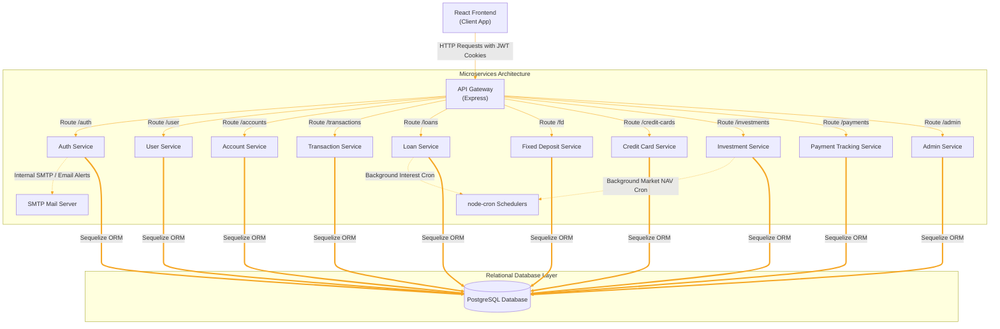

---

## 4. Microservices Breakdown

Each backend sub-application runs within a monolithic gateway environment where they are imported as modular sub-apps rather than separate standalone network processes. Therefore, they all share a central gateway host, database pool, and listen on the unified API Gateway Port.

### 4.1 Authentication Service (`auth-service`)
- **Purpose**: Responsible for validating user registrations, verifying email verification flows, generating/sending OTP hashes, and issuing JWT-based access and refresh cookie configurations.
- **Port**: Unified API Gateway Port (`5000` / `process.env.PORT`).
- **Base Route**: `/auth`
- **Dependencies**: `shared/middlewares/authMiddleware.js`, `bcrypt` credential hashing helper utilities.
- **Database Models**: `Session` (`session.model.js`), `EmailOtp` (`emailOtp.model.js`), and imports `User` (`user.model.js`).

### 4.2 User Service (`user-service`)
- **Purpose**: Exposes operations to retrieve authenticated customer profiles, submit KYC verification documents, edit personal fields, and config/reset 4-digit transaction PIN values.
- **Port**: Unified API Gateway Port (`5000` / `process.env.PORT`).
- **Base Route**: `/user`
- **Dependencies**: `shared/middlewares/authMiddleware.js`, `shared/security/transactionPinPolicy.js`.
- **Database Models**: `User` (`user.model.js`).

### 4.3 Account Service (`account-service`)
- **Purpose**: Governs checking and savings balance accounts, supporting registration, listing, detail checks, parameters updates, and soft-closures.
- **Port**: Unified API Gateway Port (`5000` / `process.env.PORT`).
- **Base Route**: `/accounts`
- **Dependencies**: `shared/middlewares/authMiddleware.js`, imports `User` (`user.model.js`).
- **Database Models**: `Account` (`account.model.js`).

### 4.4 Transaction Service (`transaction-service`)
- **Purpose**: Handles deposits, withdrawals, and inter-bank transfers by validating customer balance limits, verifying transaction PINs, and updating the ledger table.
- **Port**: Unified API Gateway Port (`5000` / `process.env.PORT`).
- **Base Route**: `/transactions`
- **Dependencies**: `shared/middlewares/authMiddleware.js`, `shared/middlewares/pinMiddleware.js`.
- **Database Models**: `Transaction` (`transaction.model.js`).

### 4.5 Loan Service (`loan-service`)
- **Purpose**: Manages user mortgage/personal applications, creates loan scheduling logs, executes EMI payments, previews foreclosures, and updates outstanding balances via node-cron calendars.
- **Port**: Unified API Gateway Port (`5000` / `process.env.PORT`).
- **Base Route**: `/loans`
- **Dependencies**: `shared/middlewares/authMiddleware.js`, `node-cron` scheduled interest calculators.
- **Database Models**: `Loan` (`loan.model.js`).

### 4.6 Fixed Deposit Service (`FD-service`)
- **Purpose**: Manages customer Fixed Deposit placements, computes maturity projections, and processes FD openings.
- **Port**: Unified API Gateway Port (`5000` / `process.env.PORT`).
- **Base Route**: `/fd`
- **Dependencies**: `shared/middlewares/authMiddleware.js`, imports `Account` (`account.model.js`).
- **Database Models**: `FixedDeposit` (`fd.model.js`).

### 4.7 Credit Card Service (`credit-card-service`)
- **Purpose**: Manages consumer credit card request pipelines, assigns limits, handles mock purchases, generates statements, and processes blocks/unblocks.
- **Port**: Unified API Gateway Port (`5000` / `process.env.PORT`).
- **Base Route**: `/credit-cards`
- **Dependencies**: `shared/middlewares/authMiddleware.js`, imports `User` (`user.model.js`).
- **Database Models**: `CreditCard` (`creditcard.model.js`).

### 4.8 Investment Service (`investment-service`)
- **Purpose**: Simulates wealth management products, maps NAV charts, handles buy/sell trades, builds portfolio balances, and recalculates market shift values using cron tasks.
- **Port**: Unified API Gateway Port (`5000` / `process.env.PORT`).
- **Base Route**: `/investments`
- **Dependencies**: `shared/middlewares/authMiddleware.js`, `node-cron` NAV calculators.
- **Database Models**: `InvestmentProduct` (`investmentProduct.model.js`), `Portfolio` (`portfolio.model.js`), `Holding` (`holding.model.js`), `InvestmentTransaction` (`investmentTransaction.model.js`), and `NavHistory` (`navHistory.model.js`).

### 4.9 Payment Tracking Service (`payment-tracking-service`)
- **Purpose**: Registers recurring upcoming bills, logs past transactions, and outputs dynamic expenditure statistics.
- **Port**: Unified API Gateway Port (`5000` / `process.env.PORT`).
- **Base Route**: `/payments`
- **Dependencies**: `shared/middlewares/authMiddleware.js`.
- **Database Models**: `Payment` (`payment.model.js`).

### 4.10 Notification Service (`notification-service`)
- **Purpose**: Decoupled mail delivery pipeline utilizing SMTP channels to send OTP sheets and alert receipts.
- **Port**: Unified API Gateway Port (`5000` / `process.env.PORT`).
- **Base Route**: Internal triggers only.
- **Dependencies**: `nodemailer` transport structures.
- **Database Models**: None (Stateless alert helper).

### 4.11 Audit Service (`audit-service`)
- **Purpose**: Captures administrative and structural mutation logs to support centralized auditing.
- **Port**: Unified API Gateway Port (`5000` / `process.env.PORT`).
- **Base Route**: Internal triggers only.
- **Dependencies**: Unified database pool references.
- **Database Models**: `AuditLog` (`auditLog.model.js`).

### 4.12 Admin Service (`admin-service`)
- **Purpose**: Exposes administrative endpoints for tracking full auditing streams, viewing KYC registers, updating customer profiles, and toggling account locks.
- **Port**: Unified API Gateway Port (`5000` / `process.env.PORT`).
- **Base Route**: `/admin`
- **Dependencies**: `shared/middlewares/authMiddleware.js`, `shared/middlewares/requireAdmin`.
- **Database Models**: Aggregates and updates models across `User`, `Account`, and `AuditLog`.

---

### 4.13 Shared Relationships & Modular Dependencies

Below is the architectural graph illustrating how request flows are routed by the API Gateway to each service, alongside the internal data models and functional verification dependencies shared between them:

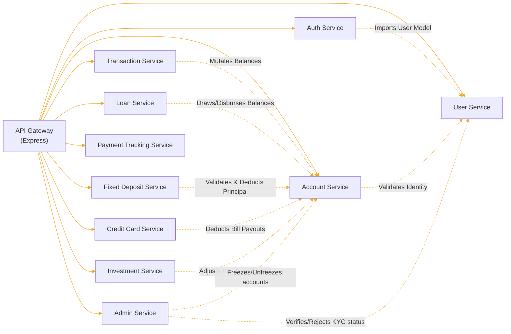

---

## 5. Database Schema

The database persistence layer is defined utilizing **Sequelize ORM** models mapping to localized PostgreSQL tables. Each schema contains structured fields, data validation constraints, and referential integrity bindings:

### 5.1 User Model (`User`)
- **Service**: `user-service`
- **Table Name**: `users`
- **Fields**:
  - `user_id` (UUID, Primary Key, Default: UUIDV4): Globally unique customer identifier.
  - `full_name` (STRING(255), Not Null, Not Empty): Customer's legal name.
  - `email` (STRING(254), Not Null, Unique, Email Validation): Customer's primary electronic mail address.
  - `phone` (STRING(15), Not Null, Unique): Customer's primary contact phone number.
  - `password_hash` (TEXT, Not Null): Cryptographically secure salted password hash.
  - `transaction_pin_hash` (TEXT, Not Null): Cryptographically secure salted 4-digit transaction authorization PIN hash.
  - `dob` (DATEONLY, Not Null): Customer's birth date.
  - `gender` (ENUM("male", "female", "other"), Not Null): Customer's gender identity.
  - `address` (TEXT, Not Null): Customer's residential address.
  - `aadhaar_number` (STRING(12), Not Null, Unique): Customer's 12-digit national identification Aadhaar number.
  - `pan_number` (STRING(10), Not Null, Unique): Customer's 10-character tax identification PAN number.
  - `occupation` (STRING(100), Not Null): Customer's active employment occupation.
  - `annual_income` (DECIMAL(15, 2), Not Null, Default: 0): Customer's reported annual salary income.
  - `kyc_status` (ENUM("pending", "verified", "rejected"), Not Null, Default: "pending"): Know-Your-Customer onboarding compliance state.
  - `role` (ENUM("customer", "admin"), Not Null, Default: "customer"): Access control role.
  - `status` (ENUM("pending", "active", "suspended", "closed"), Not Null, Default: "pending"): Operational profile status.
- **Associations**:
  - `hasMany` `Session` (as `sessions`)
  - `hasMany` `EmailOtp` (as `email_otps`)
  - `hasMany` `Account` (as `accounts`)
  - `hasMany` `Loan` (as `loans`)
  - `hasOne` `Portfolio` (as `portfolio`)
  - `hasMany` `PaymentTracking` (as `payments`)
  - `hasMany` `AuditLog` (as `audit_logs`)

### 5.2 Session Model (`Session`)
- **Service**: `auth-service`
- **Table Name**: `sessions`
- **Fields**:
  - `session_id` (UUID, Primary Key, Default: UUIDV4): Session log identifier.
  - `user_id` (UUID, Not Null, Unique, FK references `users.user_id`): Customer identifier linking to the active session.
  - `refresh_token_hash` (TEXT, Not Null): Salted cryptographic hash of the active browser refresh token.
  - `device_info` (STRING(255), Nullable): String capturing client web browser user-agent parameters.
  - `ip_address` (STRING(50), Nullable): String capturing client request IP address.
  - `expires_at` (DATE, Not Null): Absolute timestamp denoting session expiration.
  - `is_active` (BOOLEAN, Not Null, Default: true): Binary toggle to deactivate individual sessions upon manual logouts.
- **Associations**:
  - `belongsTo` `User` (as `user`)

### 5.3 Email OTP Model (`EmailOtp`)
- **Service**: `auth-service`
- **Table Name**: `email_otps`
- **Fields**:
  - `otp_id` (UUID, Primary Key, Default: UUIDV4): OTP entry identifier.
  - `user_id` (UUID, Not Null, FK references `users.user_id`): Target user identifier.
  - `email` (STRING(254), Not Null): Destination email address OTP was dispatched to.
  - `purpose` (ENUM("email_verification", "password_reset"), Not Null): Functional scenario OTP was generated to validate.
  - `otp_hash` (TEXT, Not Null): Salted cryptographic hash of the generated 6-digit code.
  - `expires_at` (DATE, Not Null): Expiration date tracking.
  - `consumed_at` (DATE, Nullable): Timestamp tracking when the OTP was successfully consumed.
  - `attempts` (INTEGER, Not Null, Default: 0): Tracker representing consecutive failed verification attempts.
  - `status` (ENUM("active", "consumed", "expired"), Not Null, Default: "active"): Status tracking OTP consumption stages.
- **Associations**:
  - `belongsTo` `User` (as `user`)

### 5.4 Account Model (`Account`)
- **Service**: `account-service`
- **Table Name**: `accounts`
- **Fields**:
  - `account_id` (UUID, Primary Key, Default: UUIDV4): Balance ledger account identifier.
  - `user_id` (UUID, Not Null, FK references `users.user_id`): Target customer owner identifier.
  - `account_number` (STRING(16), Not Null, Unique): Unique 16-character string storing the bank account number.
  - `account_type` (ENUM("savings", "current", "salary"), Not Null): Type of banking asset account.
  - `branch_code` (STRING(10), Not Null, Default: "0001"): Designated code mapping physical branch dependencies.
  - `ifsc_code` (STRING(20), Not Null, Default: "BANK0001"): Indian Financial System Code.
  - `balance` (DECIMAL(15, 2), Not Null, Default: 0): Direct accounting balance.
  - `available_balance` (DECIMAL(15, 2), Not Null, Default: 0): Liquid accounting balance available for withdrawals.
  - `min_balance` (DECIMAL(15, 2), Not Null, Default: 1000): Mandatory threshold account balance limit.
  - `initial_deposit` (DECIMAL(15, 2), Not Null): Opening deposit value.
  - `status` (ENUM("pending", "active", "frozen", "closed"), Not Null, Default: "pending"): Administrative lifecycle state.
- **Associations**:
  - `belongsTo` `User` (as `user`)
  - `hasMany` `Loan` (as `loans`)

### 5.5 Transaction Model (`Transaction`)
- **Service**: `transaction-service`
- **Table Name**: `transactions`
- **Fields**:
  - `transaction_id` (UUID, Primary Key, Default: UUIDV4): Ledger transaction record identifier.
  - `from_account_id` (UUID, Nullable): Source bank account ID.
  - `to_account_id` (UUID, Nullable): Destination bank account ID.
  - `recipient_name` (STRING, Nullable): Explicit target label name.
  - `amount` (DECIMAL(15, 2), Not Null): Absolute numeric value moved.
  - `transaction_type` (ENUM("deposit", "withdraw", "internal", "imps", "neft", "rtgs"), Not Null): Operation type.
  - `status` (ENUM("pending", "success", "failed"), Default: "success"): Operational execution state.
  - `reference_id` (STRING(100), Not Null, Unique): Globally unique reconciliation sequence ID.
- **Associations**: None (Direct logging model)

### 5.6 Loan Model (`Loan`)
- **Service**: `loan-service`
- **Table Name**: `loans`
- **Fields**:
  - `loan_id` (UUID, Primary Key, Default: UUIDV4): Loan record identifier.
  - `user_id` (UUID, Not Null, FK references `users.user_id`): Customer applicant identifier.
  - `linked_account_id` (UUID, Not Null, FK references `accounts.account_id`): Account connected for payouts and EMIs.
  - `loan_type` (ENUM("personal", "home", "vehicle", "education"), Not Null): Categorized debt product type.
  - `principal_amount` (DECIMAL(15, 2), Not Null): Total principal balance requested.
  - `approved_amount` (DECIMAL(15, 2), Nullable): Amount confirmed by admin.
  - `interest_rate` (DECIMAL(5, 2), Not Null): Annual interest rate applied to principal balance.
  - `tenure_months` (INTEGER, Not Null): Duration of debt repayment schedule.
  - `monthly_emi` (DECIMAL(15, 2), Nullable): Calculated fixed monthly payment sum.
  - `total_payable` (DECIMAL(15, 2), Nullable): Principal plus calculated amortized interest.
  - `outstanding_balance` (DECIMAL(15, 2), Nullable): Remaining balance owed to bank.
  - `next_due_date` (DATEONLY, Nullable): Target schedule payment date.
  - `loan_status` (ENUM("active", "closed", "defaulted", "foreclosed"), Not Null, Default: "active"): Outstanding debt status.
  - `approval_status` (ENUM("pending", "approved", "rejected"), Not Null, Default: "pending"): Loan workflow confirmation state.
  - `credit_score` (INTEGER, Nullable): Computed credit score metric.
  - `risk_category` (STRING(20), Nullable): String category mapping credit risk.
  - `rejection_reason` (TEXT, Nullable): Explanation notes for rejected applications.
  - `issued_at` (DATE, Nullable): Disbursement timestamp.
  - `closed_at` (DATE, Nullable): Termination timestamp.
- **Associations**:
  - `belongsTo` `User` (as `user`)
  - `belongsTo` `Account` (as `linked_account`)
  - `hasMany` `EMISchedule` (as `schedules`)
  - `hasMany` `RepaymentHistory` (as `repayments`)

### 5.7 EMI Schedule Model (`EMISchedule`)
- **Service**: `loan-service`
- **Table Name**: `emi_schedules`
- **Fields**:
  - `schedule_id` (UUID, Primary Key, Default: UUIDV4): Installment record identifier.
  - `loan_id` (UUID, Not Null, FK references `loans.loan_id`): Connected loan contract.
  - `installment_number` (INTEGER, Not Null): Sequence index of payment due.
  - `due_date` (DATEONLY, Not Null): Target payment date.
  - `emi_amount` (DECIMAL(15, 2), Not Null): Total periodic monthly installment payment.
  - `principal_component` (DECIMAL(15, 2), Not Null): Slice subtracting directly from debt principal.
  - `interest_component` (DECIMAL(15, 2), Not Null): Slice checking off accrued interest.
  - `outstanding_after` (DECIMAL(15, 2), Not Null): Remaining debt principal projected after payment.
  - `status` (ENUM("upcoming", "paid", "overdue", "partial"), Not Null, Default: "upcoming"): Repayment state tracking.
  - `paid_at` (DATE, Nullable): Actual timestamp indicating when payment was finalized.
- **Associations**:
  - `belongsTo` `Loan` (as `loan`)
  - `hasMany` `RepaymentHistory` (as `repayments`)

### 5.8 Repayment History Model (`RepaymentHistory`)
- **Service**: `loan-service`
- **Table Name**: `repayment_history`
- **Fields**:
  - `repayment_id` (UUID, Primary Key, Default: UUIDV4): Repayment transaction record identifier.
  - `loan_id` (UUID, Not Null, FK references `loans.loan_id`): Linked loan contract.
  - `schedule_id` (UUID, Nullable, FK references `emi_schedules.schedule_id`): Connected schedule installment.
  - `source_account_id` (UUID, Not Null, FK references `accounts.account_id`): Bank account debited.
  - `payment_amount` (DECIMAL(15, 2), Not Null): Value cleared.
  - `payment_type` (ENUM("emi", "partial", "foreclosure"), Not Null): Payment category.
  - `paid_at` (DATE, Not Null, Default: NOW): Operational timestamp.
- **Associations**:
  - `belongsTo` `Loan` (as `loan`)
  - `belongsTo` `EMISchedule` (as `schedule`)

### 5.9 Fixed Deposit Model (`FD`)
- **Service**: `FD-service`
- **Table Name**: `fds`
- **Fields**:
  - `id` (UUID, Primary Key, Default: UUIDV4): Fixed deposit transaction record identifier.
  - `user_id` (UUID, Not Null): Linked owner identifier.
  - `account_id` (UUID, Not Null): Source account debited for principal.
  - `principal_amount` (FLOAT, Not Null): Deposited principal balance.
  - `interest_rate` (FLOAT, Not Null): Annual return yield rate locked.
  - `tenure_months` (INTEGER, Not Null): Holding duration.
  - `maturity_amount` (FLOAT, Nullable): Projected total principal plus locked compounding returns.
  - `status` (ENUM("ACTIVE", "MATURED", "CLOSED"), Default: "ACTIVE"): Active deposit lifecycle state.
  - `start_date` (DATE, Default: NOW): Initialization timestamp.
  - `maturity_date` (DATE, Nullable): Expiry timestamp.
- **Associations**: None (Decoupled auditing reference model)

### 5.10 Credit Card Model (`CreditCard`)
- **Service**: `credit-card-service`
- **Table Name**: `CreditCards`
- **Fields**:
  - `card_id` (UUID, Primary Key, Default: UUIDV4): Credit card record identifier.
  - `user_id` (UUID, Not Null): Connected owner identifier.
  - `linked_account_id` (UUID, Not Null): Connected checking/savings account.
  - `card_number` (STRING, Unique, Not Null): Structured mock credit card number.
  - `card_type` (STRING, Not Null): Product tier.
  - `credit_limit` (DECIMAL(15, 2), Not Null): Total spending limit.
  - `available_limit` (DECIMAL(15, 2), Not Null): Liquid spend limit remaining.
  - `outstanding_balance` (DECIMAL(15, 2), Default: 0): Debt balance currently accumulated.
  - `minimum_due` (DECIMAL(15, 2), Default: 0): Minimum payment threshold due.
  - `billing_cycle_date` (INTEGER, Not Null): Calendar day card statements are calculated.
  - `due_date` (DATEONLY, Nullable): Target billing settlement date.
  - `interest_rate` (DECIMAL(5, 4), Not Null, Default: 0.0360): Accruing interest rate per cycle.
  - `penalty_rate` (DECIMAL(5, 4), Not Null, Default: 0.0200): Accruing late payment charge.
  - `penalty_applied` (BOOLEAN, Not Null, Default: false): Late payment trigger status.
  - `last_billing_date` (DATEONLY, Nullable): Date card statement was computed.
  - `status` (ENUM("active", "blocked", "closed"), Default: "active"): Product card state toggle.
- **Associations**: None (Decoupled model)

### 5.11 Investment Product Model (`InvestmentProduct`)
- **Service**: `investment-service`
- **Table Name**: `investment_products`
- **Fields**:
  - `product_id` (UUID, Primary Key, Default: UUIDV4): Securities product identifier.
  - `product_name` (STRING(255), Not Null): Securities name.
  - `investment_type` (ENUM("mutual_fund", "equity", "bond", "gold"), Not Null): Product investment type.
  - `risk_level` (ENUM("low", "medium", "high"), Not Null): Categorized risk index.
  - `nav_value` (DECIMAL(15, 4), Not Null): Active Net Asset Value.
  - `minimum_investment` (DECIMAL(15, 2), Not Null, Default: 500): Opening entry transaction limit.
  - `expense_ratio` (DECIMAL(5, 2), Not Null, Default: 0): Performance maintenance charge.
  - `status` (ENUM("active", "inactive"), Not Null, Default: "active"): Asset transactional toggle.
- **Associations**:
  - `hasMany` `Holding` (as `holdings`)
  - `hasMany` `NavHistory` (as `nav_history`)

### 5.12 Portfolio Model (`Portfolio`)
- **Service**: `investment-service`
- **Table Name**: `portfolios`
- **Fields**:
  - `portfolio_id` (UUID, Primary Key, Default: UUIDV4): Portfolio record identifier.
  - `user_id` (UUID, Not Null, Unique, FK references `users.user_id`): Connected owner identifier.
  - `risk_profile` (ENUM("low", "medium", "high"), Not Null, Default: "low"): Profile risk categorizations.
  - `total_invested` (DECIMAL(15, 2), Not Null, Default: 0): Capital deposited.
  - `current_value` (DECIMAL(15, 2), Not Null, Default: 0): Live value of holding.
  - `total_returns` (DECIMAL(15, 2), Not Null, Default: 0): Accrued value delta.
- **Associations**:
  - `belongsTo` `User` (as `user`)
  - `hasMany` `Holding` (as `holdings`)
  - `hasMany` `InvestmentTransaction` (as `investment_transactions`)

### 5.13 Holding Model (`Holding`)
- **Service**: `investment-service`
- **Table Name**: `investment_holdings`
- **Fields**:
  - `holding_id` (UUID, Primary Key, Default: UUIDV4): Holdings record identifier.
  - `portfolio_id` (UUID, Not Null, FK references `portfolios.portfolio_id`): Linked portfolio container.
  - `product_id` (UUID, Not Null, FK references `investment_products.product_id`): Linked securities asset.
  - `units` (DECIMAL(18, 6), Not Null, Default: 0): Purchased share balance.
  - `average_nav` (DECIMAL(15, 4), Not Null, Default: 0): Average NAV price at purchase.
  - `invested_amount` (DECIMAL(15, 2), Not Null, Default: 0): Opening capital locked.
  - `current_value` (DECIMAL(15, 2), Not Null, Default: 0): Live evaluation value.
- **Associations**:
  - `belongsTo` `Portfolio` (as `portfolio`)
  - `belongsTo` `InvestmentProduct` (as `product`)

### 5.14 Investment Transaction Model (`InvestmentTransaction`)
- **Service**: `investment-service`
- **Table Name**: `investment_transactions`
- **Fields**:
  - `transaction_id` (UUID, Primary Key, Default: UUIDV4): Trade record identifier.
  - `portfolio_id` (UUID, Not Null, FK references `portfolios.portfolio_id`): Target portfolio container.
  - `product_id` (UUID, Not Null, FK references `investment_products.product_id`): Target securities asset.
  - `source_account_id` (UUID, Not Null, FK references `accounts.account_id`): Bank account debited/credited.
  - `transaction_type` (ENUM("buy", "sell"), Not Null): Operational direction.
  - `amount` (DECIMAL(15, 2), Not Null): Total capital traded.
  - `units` (DECIMAL(18, 6), Not Null): Total shares traded.
  - `nav_at_execution` (DECIMAL(15, 4), Not Null): Execution NAV unit price.
  - `status` (ENUM("success", "failed"), Not Null, Default: "success"): Operational processing state.
- **Associations**:
  - `belongsTo` `Portfolio` (as `portfolio`)
  - `belongsTo` `InvestmentProduct` (as `product`)

### 5.15 NAV History Model (`NavHistory`)
- **Service**: `investment-service`
- **Table Name**: `nav_history`
- **Fields**:
  - `nav_id` (UUID, Primary Key, Default: UUIDV4): Historical NAV record identifier.
  - `product_id` (UUID, Not Null, FK references `investment_products.product_id`): Target securities asset.
  - `nav_value` (DECIMAL(15, 4), Not Null): Computed Net Asset Value.
  - `nav_date` (DATEONLY, Not Null): Calendar tracking date.
- **Associations**:
  - `belongsTo` `InvestmentProduct` (as `product`)

### 5.16 Payment Tracking Model (`PaymentTracking`)
- **Service**: `payment-tracking-service`
- **Table Name**: `payment_tracking`
- **Fields**:
  - `payment_tracking_id` (UUID, Primary Key, Default: UUIDV4): Bill/EMI tracking log.
  - `user_id` (UUID, Not Null, FK references `users.user_id`): Linked customer owner.
  - `payment_type` (ENUM("CREDIT_CARD", "LOAN", "TRANSFER", "BILL", "EMI"), Not Null): Categorized transactional type.
  - `transaction_type` (ENUM("PURCHASE", "PAYMENT", "REFUND", "EMI", "REVERSAL"), Default: "PAYMENT"): Transaction category.
  - `merchant_name` (STRING(100), Nullable): Associated target corporate merchant.
  - `category` (STRING(50), Default: "General"): Expense category.
  - `amount` (DECIMAL(15, 2), Not Null): Total value.
  - `currency` (STRING(3), Not Null, Default: "INR"): Standard currency label.
  - `status` (ENUM("SUCCESS", "FAILED", "PENDING"), Not Null, Default: "PENDING"): Verification tracking state.
  - `payment_method` (ENUM("BANK_TRANSFER", "CARD", "UPI", "NET_BANKING"), Not Null): Interface channel.
  - `reference_id` (STRING(100), Not Null, Unique): Reconciliation sequence identifier.
  - `related_entity_id` (STRING(100), Nullable): Mapped loan or card identifier.
  - `description` (TEXT, Nullable): Description metadata.
- **Associations**:
  - `belongsTo` `User` (as `user`)

### 5.17 Audit Log Model (`AuditLog`)
- **Service**: `audit-service`
- **Table Name**: `audit_logs`
- **Fields**:
  - `log_id` (UUID, Primary Key, Default: UUIDV4): Operational audit log.
  - `user_id` (UUID, Nullable, FK references `users.user_id`): Action user identifier.
  - `action_type` (STRING(100), Not Null): Categorized log action.
  - `entity_type` (STRING(100), Not Null): Impacted database component table.
  - `entity_id` (STRING(255), Nullable): Targeted primary key ID.
  - `ip_address` (STRING(50), Nullable): Associated request IP address.
  - `status` (ENUM("success", "failure"), Not Null): Success/failure category.
  - `metadata` (JSONB, Nullable): JSON metadata.
- **Associations**: None (Direct logging model)

---

### 5.18 Unified Entity-Relationship (ER) Diagram

Below is the database Entity-Relationship schema representing database tables, relational indices, and target card/loan mappings with their exact foreign key constraints:

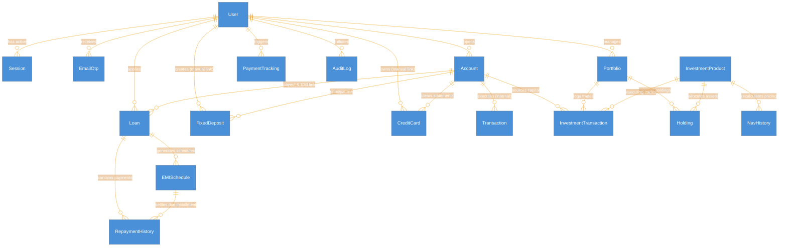

---

## 6. API Reference

All requests to modules other than Authentication require a valid JWT cookie payload set by the gateway's validation middleware.

### 6.1 Authentication Module (`auth-service`)

| Method | Endpoint | Controller Function | Auth Required | Pin Required | Description |
|---|---|---|---|---|---|
| POST | `/auth/register` | `register` | No | No | Onboards a new user, hashes passwords/PINs, and triggers verification OTP email. |
| POST | `/auth/verify-email` | `verifyEmail` | No | No | Consumes verification OTP to transition user status to active. |
| POST | `/auth/resend-verification-otp` | `resendVerificationOtp` | No | No | Regens and sends new OTP if previous verification code expired. |
| POST | `/auth/login` | `login` | No | No | Authenticates credentials and sets access and refresh tokens in secure cookies. |
| POST | `/auth/refresh` | `refresh` | No | No | Authenticates refresh token cookie to issue a new access token silently. |
| POST | `/auth/forgot-password` | `forgotPassword` | No | No | Initiates password recovery process by mailing a reset-purpose OTP code. |
| POST | `/auth/reset-password` | `resetPassword` | No | No | Verifies reset OTP to safely update user credentials with a new password hash. |
| POST | `/auth/logout` | `logout` | No | No | Clears secure cookies and marks user session as inactive. |

### 6.2 User Profile Module (`user-service`)

| Method | Endpoint | Controller Function | Auth Required | Pin Required | Description |
|---|---|---|---|---|---|
| GET | `/user/me` | `getUserProfile` | Yes | No | Returns the authenticated customer's full profile details. |
| PUT | `/user/me` | `updateUserProfile` | Yes | No | Updates standard user parameters (phone, gender, address, occupation). |
| PATCH | `/user/kyc` | `updateKYC` | Yes | No | Submits/updates customer KYC document status. |
| PATCH | `/user/kyc/verify` | `verifyKYC` | Yes | No | Internal controller to verify customer KYC status. |
| PATCH | `/user/status` | `updateUserStatus` | Yes | No | Administrative override of user lifecycle status (e.g. suspended, active). |
| GET | `/user/all` | `getAllUsers` | Yes | No | Admin-restricted list of all registered system users. |
| POST | `/user/reset-transaction-pin` | `resetTransactionPin` | Yes | No | Permits users to set/update their 4-digit transaction authorization PIN. |

### 6.3 Account Management Module (`account-service`)

| Method | Endpoint | Controller Function | Auth Required | Pin Required | Description |
|---|---|---|---|---|---|
| POST | `/accounts/` | `createAccount` | Yes | No | Generates a new checking/savings account with branch details and min balances. |
| GET | `/accounts/user/me` | `getUserAccounts` | Yes | No | Lists all savings, checking, or salary accounts owned by the active user. |
| GET | `/accounts/:id` | `getAccountById` | Yes | No | Retrieves detailed status, branch code, and available balances for a specific account. |
| PUT | `/accounts/:id` | `updateAccount` | Yes | No | Updates metadata parameter attributes for a specific account. |
| DELETE | `/accounts/:id` | `closeAccount` | Yes | No | Marks a specific user account status as closed. |

### 6.4 Transaction Ledger Module (`transaction-service`)

| Method | Endpoint | Controller Function | Auth Required | Pin Required | Description |
|---|---|---|---|---|---|
| POST | `/transactions/transfer` | `transfer` | Yes | Yes | Validates source balance, checks transaction PIN, and moves funds between accounts. |
| POST | `/transactions/deposit` | `deposit` | Yes | Yes | Simulates account cash credit loading by adding funds into a target account balance. |
| POST | `/transactions/withdraw` | `withdraw` | Yes | Yes | Deducts balance amount from target user account. |
| GET | `/transactions/history/:account_id` | `getHistory` | Yes | No | Lists transaction logs (debits/credits) for a specific account. |
| GET | `/transactions/all` | `getAllTransactions` | Yes | No | Retrieves full transaction histories for all accounts belonging to the active user. |

### 6.5 Loan Management Module (`loan-service`)

| Method | Endpoint | Controller Function | Auth Required | Pin Required | Description |
|---|---|---|---|---|---|
| GET | `/loans/user/me` | `getUserLoans` | Yes | No | Returns loan applications and active contracts belonging to the user. |
| GET | `/loans/active-summary` | `getActiveLoansSummary` | Yes | No | Provides EMI liability totals and slot counts for active loans. |
| POST | `/loans/apply` | `applyNewLoan` | Yes | No | Triggers loan credit risk scoring and creates loan contract applications. |
| POST | `/loans/payment` | `makeLoanPayment` | Yes | No | Processes EMI installments, updating schedules and outstanding balances. |
| GET | `/loans/schedule/:id` | `generateLoanSchedule` | Yes | No | Returns structured amortization EMI due dates and payment status lists. |
| GET | `/loans/:id` | `getLoanDetails` | Yes | No | Retrieves specific loan balance metrics, schedules, and interest rates. |
| POST | `/loans/foreclose/:id` | `processLoanForeclosure` | Yes | No | Settles full loan balance immediately from a linked account. |
| GET | `/loans/foreclose-preview/:id` | `getForeclosurePreview` | Yes | No | Computes foreclosure payout amounts without committing a deduction. |
| PATCH | `/loans/status/:id` | `updateLoanStatus` | Yes | No | Admin-restricted endpoint to approve/reject loan applications. |

### 6.6 Fixed Deposit Module (`FD-service`)

| Method | Endpoint | Controller Function | Auth Required | Pin Required | Description |
|---|---|---|---|---|---|
| POST | `/fd/create` | `createFD` | Yes | No | Creates active Fixed Deposit by debiting principal from checking/savings balance. |
| GET | `/fd/` | `getFDs` | Yes | No | Lists all active, matured, or closed Fixed Deposits owned by the user. |
| GET | `/fd/:id` | `getFDById` | Yes | No | Retrieves maturity projections and start details for a specific FD. |
| PATCH | `/fd/close/:id` | `closeFD` | Yes | No | Terminates Fixed Deposit prematurely (moves balance back to source account). |

### 6.7 Credit Card Module (`credit-card-service`)

| Method | Endpoint | Controller Function | Auth Required | Pin Required | Description |
|---|---|---|---|---|---|
| POST | `/credit-cards/apply` | `applyNewCard` | Yes | No | Onboards user for a credit card, setting credit limits and billing cycle parameters. |
| GET | `/credit-cards/user/me` | `getUserCards` | Yes | No | Lists all mock credit cards issued to the customer. |
| GET | `/credit-cards/statement/:id` | `generateCardStatement` | Yes | No | Aggregates purchases, updates outstanding balances, and returns monthly bill statement. |
| GET | `/credit-cards/:id` | `getCardDetails` | Yes | No | Returns spending limit metrics and cycle parameters for a specific card. |
| POST | `/credit-cards/purchase` | `processCardPurchase` | Yes | No | Simulates credit transactions, deducting from available limits and updating balance. |
| POST | `/credit-cards/payment` | `makeCardPayment` | Yes | No | Pays down card balance from checking/savings accounts. |
| PATCH | `/credit-cards/block/:id` | `blockCustomerCard` | Yes | No | Blocks card, suspending transactional capabilities. |
| PATCH | `/credit-cards/unblock/:id` | `unblockCustomerCard` | Yes | No | Re-enables transactional capabilities on a blocked card. |
| PATCH | `/credit-cards/close/:id` | `closeCard` | Yes | No | Processes credit card soft-closure (requires zero outstanding balance). |
| DELETE | `/credit-cards/:id` | `deleteCard` | Yes | No | Clears a closed credit card record. |

### 6.8 Wealth Management & Investment Module (`investment-service`)

| Method | Endpoint | Controller Function | Auth Required | Pin Required | Description |
|---|---|---|---|---|---|
| GET | `/investments/products` | `getProducts` | Yes | No | Lists all active mutual funds, equities, bonds, or gold investment assets. |
| GET | `/investments/market` | `getMarketOverview` | Yes | No | Summarizes active market product types, NAV indicators, and performance delta. |
| GET | `/investments/products/:id/nav-history` | `getProductNavHistory` | Yes | No | Returns Net Asset Value (NAV) historical progression points. |
| POST | `/investments/buy` | `buyInvestmentProduct` | Yes | No | Processes order to buy asset units, debiting from checking/savings. |
| POST | `/investments/sell` | `sellInvestmentProduct` | Yes | No | Liquidates asset holdings, crediting returns directly to a bank account. |
| GET | `/investments/portfolio/me` | `getPortfolio` | Yes | No | Returns portfolio values, total returns, and individual holdings. |
| GET | `/investments/statement/me` | `generatePortfolioStatement` | Yes | No | Compiles historical investment transaction lines. |

### 6.9 Payment Tracking Module (`payment-tracking-service`)

| Method | Endpoint | Controller Function | Auth Required | Pin Required | Description |
|---|---|---|---|---|---|
| GET | `/payments/` | `getPayments` | Yes | No | Returns histories of all payments triggered by the customer. |
| GET | `/payments/analytics` | `getAnalytics` | Yes | No | Renders monthly and category analytics datasets. |
| GET | `/payments/:referenceId` | `getPaymentByRef` | Yes | No | Retrieves tracking details for a specific payment reference. |
| POST | `/payments/create` | `createPayment` | Yes | No | Records a new payment action line for bill payments, loans, or transfers. |

### 6.10 Administrative Module (`admin-service`)

| Method | Endpoint | Controller Function | Auth Required | Pin Required | Description |
|---|---|---|---|---|---|
| GET | `/admin/kyc/pending` | `getPendingKYCUsers` | Yes | No | Lists all users with pending KYC status needing verification. |
| PATCH | `/admin/kyc/verify/:user_id` | `verifyKYC` | Yes | No | Approves user onboarding files, moving customer KYC status to verified. |
| PATCH | `/admin/kyc/reject/:user_id` | `rejectKYC` | Yes | No | Rejects user onboarding files, appending feedback. |
| GET | `/admin/audit-logs` | `getAllAuditLogs` | Yes | No | Lists system audit events chronologically. |
| GET | `/admin/audit-logs/failures` | `getFailureAuditLogs` | Yes | No | Filters auditing logs to show only failures. |
| GET | `/admin/audit-logs/:user_id` | `getUserAuditLogs` | Yes | No | Returns audit trails matching a specific customer ID. |
| GET | `/admin/users` | `getAllUsers` | Yes | No | Lists all customers registered on the platform. |
| GET | `/admin/users/:user_id` | `getUserDetails` | Yes | No | Retrieves detailed demographics and profiles for a specific user. |
| PATCH | `/admin/users/suspend/:user_id` | `suspendUser` | Yes | No | Suspends user credentials, blocking login actions. |
| PATCH | `/admin/users/activate/:user_id` | `activateUser` | Yes | No | Re-activates user credentials. |
| GET | `/admin/accounts` | `getAllAccounts` | Yes | No | Lists all active bank balance accounts. |
| PATCH | `/admin/accounts/freeze/:account_id` | `freezeUserAccount` | Yes | No | Freezes account, suspending withdrawals and debits. |
| PATCH | `/admin/accounts/unfreeze/:account_id` | `unfreezeUserAccount` | Yes | No | Unfreezes account, restoring withdrawal and debit capabilities. |

---

### 6.11 Unified Request Pipeline Sequence

The sequence diagram below represents three core modules mapping customer registrations, transaction validations (PIN enforced), and wealth management product purchases:

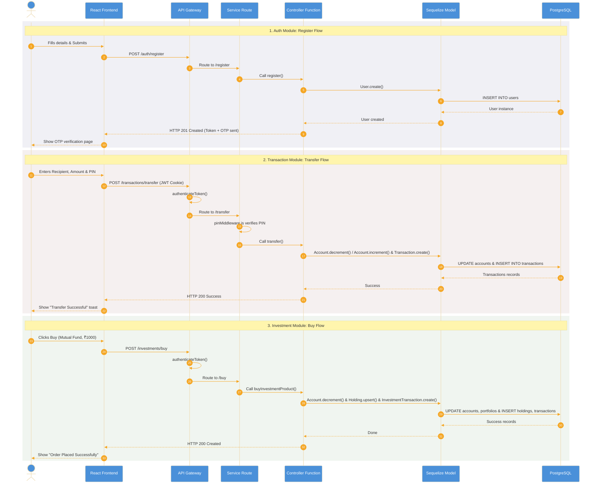

---

## 7. Module — Function Breakdown

Below is a detailed granular breakdown of every controller function implemented across all microservice directories:

### 7.1 Authentication Module (`auth-service`)

#### 7.1.1 `registerUser`
- **Input**:
  - `req.body` containing structured `auth` (email, phone, password, transaction_pin) and `user` (full_name, dob, gender, address, aadhaar_number, pan_number) schemas.
- **Steps**:
  1. Standardizes incoming email string formats via normalization logic.
  2. Executes validation rules across auth and user credentials.
  3. Queries PostgreSQL database to check if email, phone, Aadhaar, or PAN are already linked to an existing profile. Returns HTTP 409 if active.
  4. Salts and hashes password and transaction PIN hashes via `bcrypt`.
  5. Performs database create transaction to insert record into `users` table with status set to `pending`.
  6. Generates a unique 6-digit OTP code using EmailOtp model templates.
  7. Spawns asynchronous alert task using `nodemailer` to email the OTP verification code to the customer.
  8. Commits registration event audit trail in `audit_logs`.
- **Output**:
  - Success: HTTP 201 with structured user metadata, setting `requires_email_verification: true`.
  - Failure: HTTP 400 (Validation failed), HTTP 409 (Conflict on inputs), or HTTP 500 (Server error).
- **Models Used**: `User`, `EmailOtp`, `AuditLog`.
- **Calls**: `validateAuthInput()`, `validateUserInput()`, `checkExistingUser()`, `prepareUserCredentials()`, `createUser()`, `createEmailOtp()`, `notifyEmailVerificationOtp()`, `logRegistration()`.

#### 7.1.2 `verifyEmail`
- **Input**:
  - `req.body.email` and `req.body.otp` strings.
- **Steps**:
  1. Validates input existence, normalizing the target email string.
  2. Queries user record by email; checks if profile state is pending.
  3. Calls verify OTP service which extracts target hash, checks attempt counts, checks expires timestamp, hashes incoming OTP and compares. If mismatched, increments attempts and throws errors.
  4. Updates target user record status to `active` and kyc_status to `pending`.
  5. Performs updates setting linked pending accounts status to `active`.
  6. Generates token credentials (`access_token` and `refresh_token`).
  7. Inserts new entry in `sessions` table mapping active devices and IP strings.
  8. Configures secure, HTTP-only cookie headers on response.
  9. Enqueues registration email alert to `nodemailer`.
- **Output**:
  - Success: HTTP 200 with active user demographics and cookies.
  - Failure: HTTP 400 (Invalid OTP / mismatch/expired) or HTTP 404 (User not found).
- **Models Used**: `User`, `EmailOtp`, `Account`, `Session`.
- **Calls**: `getUserByEmail()`, `verifyEmailOtp()`, `activateUser()`, `generateUserTokens()`, `createSession()`, `setAuthCookies()`, `notifyRegister()`.

#### 7.1.3 `loginUser`
- **Input**:
  - `req.body.email` and `req.body.password`.
- **Steps**:
  1. Standardizes incoming email string, validating presence of credentials.
  2. Queries user record from database by email. If missing, registers audit event and returns invalid credentials.
  3. Computes hash comparisons using `bcrypt.compare` against `password_hash`. If unmatched, logs fail audit event and rejects.
  4. Inspects status; if pending, returns error requiring OTP validation.
  5. Generates cryptographically signed access and refresh tokens.
  6. Replaces current active user session record inside `sessions` table, resetting parameters.
  7. Sets HTTP-only cookies on headers and logs login success.
- **Output**:
  - Success: HTTP 200 with cookies, returning user details.
  - Failure: HTTP 400 (Validation failed), HTTP 401 (Invalid password/email), HTTP 403 (Account suspended/pending), or HTTP 500.
- **Models Used**: `User`, `Session`, `AuditLog`.
- **Calls**: `validateLoginInput()`, `getUserByEmail()`, `bcrypt.compare()`, `generateUserTokens()`, `createSession()`, `setAuthCookies()`, `notifyLogin()`, `logLogin()`.

#### 7.1.4 `refreshToken`
- **Input**:
  - `req.cookies.refresh_token`.
- **Steps**:
  1. Pulls cookie refresh token. If missing, rejects with HTTP 401.
  2. Decodes payload to extract user metadata context.
  3. Fetches active user session record from database.
  4. Evaluates expiration timestamps. If expired, revokes session and rejects.
  5. Uses `bcrypt.compare` to match token string against saved session hash. If mismatch, revokes session immediately and rejects.
  6. Spins new tokens, updates DB session record with rotated token hash, and sets fresh cookies.
- **Output**:
  - Success: HTTP 200 with rotated cookies.
  - Failure: HTTP 401 (Expired/Invalid) or HTTP 500.
- **Models Used**: `Session`.
- **Calls**: `verifyRefreshToken()`, `getActiveSession()`, `revokeSession()`, `generateUserTokens()`, `createSession()`, `setAuthCookies()`.

#### 7.1.5 `logoutUser`
- **Input**:
  - `req.user.user_id` and cookie tokens.
- **Steps**:
  1. Revokes active session row in `sessions` table.
  2. Triggers cookie headers deletion overrides, clearing storage.
- **Output**:
  - Success: HTTP 200 clear message.
  - Failure: HTTP 500.
- **Models Used**: `Session`.
- **Calls**: `revokeSession()`, `res.clearCookie()`.

#### 7.1.6 `requestPasswordReset`
- **Input**:
  - `req.body.email`.
- **Steps**:
  1. Normalizes email and queries active user.
  2. Creates email OTP row with purpose set to `password_reset`.
  3. Enqueues reset OTP email via `nodemailer` transport pipelines.
- **Output**:
  - Success: HTTP 200 notification confirmation.
- **Models Used**: `User`, `EmailOtp`.
- **Calls**: `getUserByEmail()`, `createEmailOtp()`, `notifyPasswordResetOtp()`.

#### 7.1.7 `resetPassword`
- **Input**:
  - `req.body.email`, `req.body.otp`, and `req.body.new_password`.
- **Steps**:
  1. Validates password complexity policy constraints.
  2. Verifies recovery OTP hash values and timestamps inside `email_otps` table.
  3. Hashes the new password credentials and performs update.
  4. Records security audit log entry.
- **Output**:
  - Success: HTTP 200 confirmation message.
  - Failure: HTTP 400 (Invalid complexity/OTP) or HTTP 500.
- **Models Used**: `User`, `EmailOtp`, `AuditLog`.
- **Calls**: `validatePassword()`, `getUserByEmail()`, `verifyEmailOtp()`, `updatePassword()`, `logSecurityEvent()`.

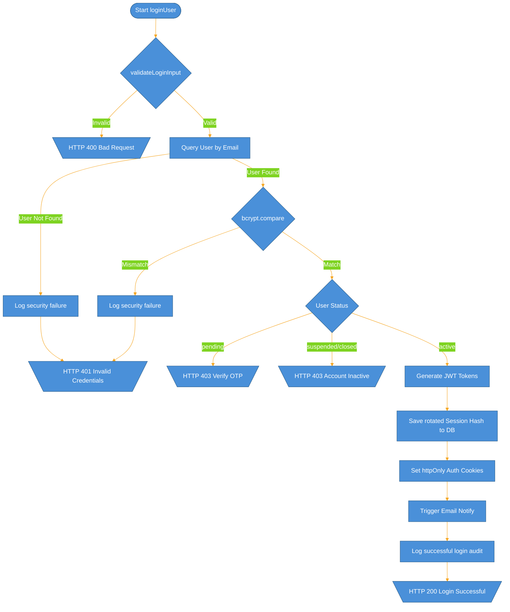

---

### 7.2 User Profile Module (`user-service`)

#### 7.2.1 `getUserProfile`
- **Input**:
  - `req.user.user_id` parsed context.
- **Steps**:
  1. Queries DB using primary key mapping to find User record.
  2. Returns user details, filtering out security hashes.
- **Output**:
  - Success: HTTP 200 with customer demographics.
  - Failure: HTTP 404 (Not found) or HTTP 500.
- **Models Used**: `User`.

#### 7.2.2 `updateUserProfile`
- **Input**:
  - `req.user.user_id` context, `req.body` containing profile attributes.
- **Steps**:
  1. Validates update attributes.
  2. Mutates profile variables in matching database row.
- **Output**:
  - Success: HTTP 200 with updated object.
- **Models Used**: `User`.

#### 7.2.3 `updateKYC`
- **Input**:
  - `req.user.user_id`, `req.body.kyc_document` path parameters.
- **Steps**:
  1. Checks if user exists.
  2. Updates target `kyc_status` to `pending`.
- **Output**:
  - Success: HTTP 200.
- **Models Used**: `User`.

#### 7.2.4 `resetTransactionPin`
- **Input**:
  - `req.user.user_id`, `req.body.old_pin`, `req.body.new_pin`.
- **Steps**:
  1. Fetches user security profile.
  2. Validates complexity guidelines and hashes old PIN to match current database hash.
  3. Encrypts the new 4-digit PIN using `bcrypt` and overrides `transaction_pin_hash`.
- **Output**:
  - Success: HTTP 200 PIN reset confirmation.
  - Failure: HTTP 400 (Invalid validation/old pin mismatched).
- **Models Used**: `User`.

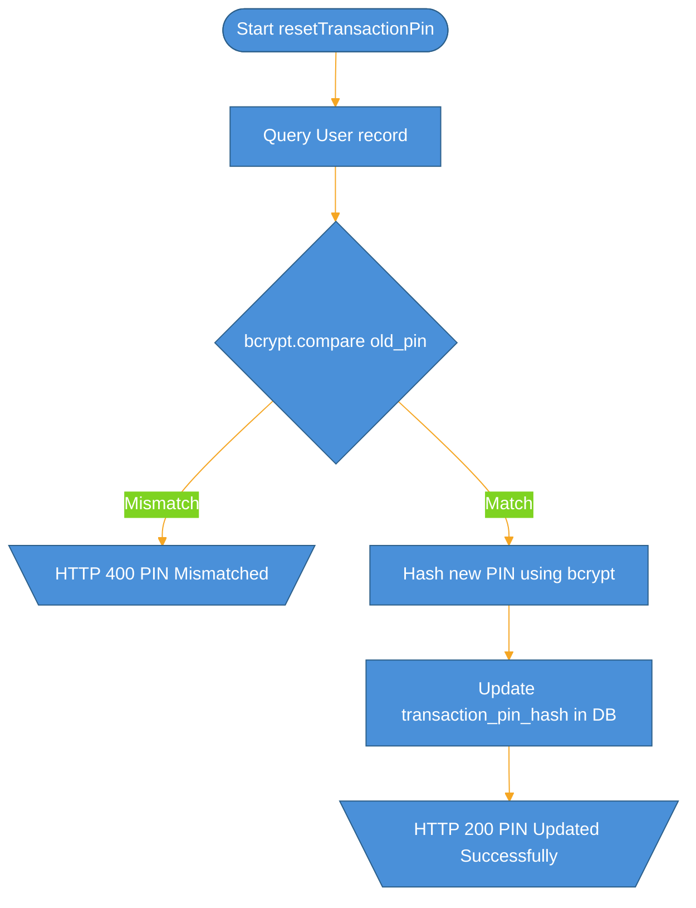

---

### 7.3 Account Management Module (`account-service`)

#### 7.3.1 `createAccount`
- **Input**:
  - `req.user.user_id`, `req.body.account_type`, `req.body.initial_deposit`, `req.body.branch_code`, `req.body.ifsc_code`.
- **Steps**:
  1. Queries User record to check KYC compliance status. If kyc_status is not `verified`, rejects with HTTP 403.
  2. Verifies starting deposit value meets min threshold.
  3. Generates a random, unique 16-character account number.
  4. Performs database insert in `accounts` table.
  5. Commits audit trails.
- **Output**:
  - Success: HTTP 201 with generated account profile.
  - Failure: HTTP 403 (KYC pending), HTTP 400 (Min balance unmet) or HTTP 500.
- **Models Used**: `User`, `Account`, `AuditLog`.

#### 7.3.2 `getUserAccounts`
- **Input**:
  - `req.user.user_id`.
- **Steps**:
  1. Queries all non-closed accounts matching user ID.
- **Output**:
  - Success: HTTP 200 list.
- **Models Used**: `Account`.

#### 7.3.3 `closeAccount`
- **Input**:
  - `req.params.id`.
- **Steps**:
  1. Fetches target Account record.
  2. Verifies account balance is zero. If not, rejects.
  3. Updates account status to `closed`.
- **Output**:
  - Success: HTTP 200 closed success.
- **Models Used**: `Account`.

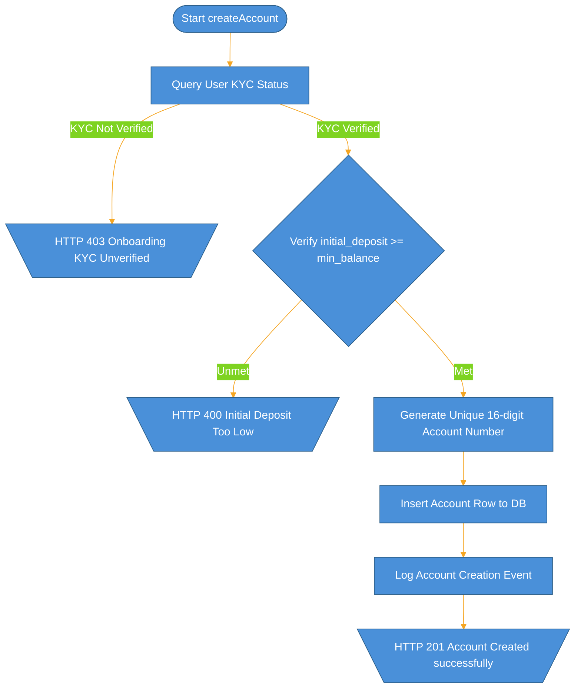

---

### 7.4 Transaction Ledger Module (`transaction-service`)

#### 7.4.1 `transfer`
- **Input**:
  - `req.user.user_id`, `req.body.from_account_id`, `req.body.to_account_number`, `req.body.amount`, `req.body.recipient_name`.
- **Steps**:
  1. Triggered after `pinMiddleware` checks transaction PIN.
  2. Establishes a database transaction block.
  3. Locks and queries source bank account, checking status is active and available balances meet payment values. If frozen/suspended, rolls back.
  4. Queries recipient bank account by account number. If not active, rolls back.
  5. Subtracts amount from source account balance and available_balance.
  6. Adds amount to recipient account balance and available_balance.
  7. Inserts transaction log entry into `transactions` table.
  8. Commits database transaction.
- **Output**:
  - Success: HTTP 200 with transaction logs.
  - Failure: HTTP 400 (Insufficient funds), HTTP 404 (Recipient not active/found), or HTTP 500.
- **Models Used**: `Account`, `Transaction`.
- **Calls**: `sequelize.transaction()`, `Account.findOne()`, `Transaction.create()`.

#### 7.4.2 `deposit` / `withdraw`
- **Input**:
  - `req.body.account_id`, `req.body.amount`, `req.body.pin`.
- **Steps**:
  1. Validates transaction PIN.
  2. Locks target account.
  3. Mutates balances (addition for deposit, subtraction for withdraw).
  4. Inserts Transaction logging record.
- **Output**:
  - Success: HTTP 200.
- **Models Used**: `Account`, `Transaction`.

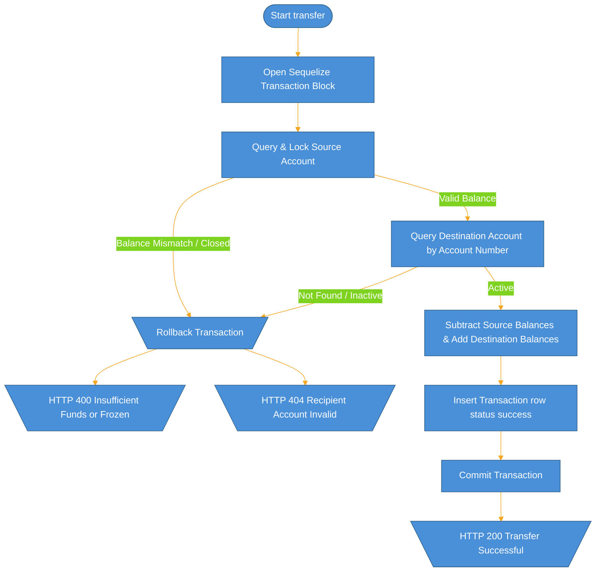

---

### 7.5 Loan Management Module (`loan-service`)

#### 7.5.1 `applyNewLoan`
- **Input**:
  - `req.user.user_id`, `req.body.loan_type`, `req.body.principal_amount`, `req.body.tenure_months`, `req.body.linked_account_id`.
- **Steps**:
  1. Checks linked account status.
  2. Queries KYC status.
  3. Executes mock credit check. If credit score is under 600, automatically sets approval_status to `rejected`.
  4. If credit score is high, sets approval_status to `approved`.
  5. Calculates interest amortization totals, monthly EMIs, and outstanding principal.
  6. Saves record inside `loans` table.
  7. Generates complete amortized EMI due entries inside `emi_schedules` if approved.
  8. Disburses principal directly into user linked account available balance.
- **Output**:
  - Success: HTTP 201 with loan applications.
- **Models Used**: `User`, `Account`, `Loan`, `EMISchedule`.

#### 7.5.2 `makeLoanPayment`
- **Input**:
  - `req.body.loan_id`, `req.body.payment_amount`, `req.body.source_account_id`.
- **Steps**:
  1. Fetches loan contract details.
  2. Checks source account balance, debiting payment values.
  3. Deducts paid amounts from loan outstanding balance.
  4. Queries upcoming scheduled EMI entry, marking target status to `paid`.
  5. Inserts payment log into `repayment_history`.
- **Output**:
  - Success: HTTP 200 loan summary.
- **Models Used**: `Account`, `Loan`, `EMISchedule`, `RepaymentHistory`.

#### 7.5.3 `processLoanForeclosure`
- **Input**:
  - `req.params.id` and linked source accounts.
- **Steps**:
  1. Establishes foreclosure payoff totals (remaining outstanding principal).
  2. Debits total foreclosure sum from user balance.
  3. Updates loan status to `foreclosed` and outstanding balance to zero.
  4. Marks all unpaid schedules to `paid` or `closed`.
  5. Writes foreclosure log into `repayment_history`.
- **Output**:
  - Success: HTTP 200 foreclose success.
- **Models Used**: `Account`, `Loan`, `EMISchedule`, `RepaymentHistory`.

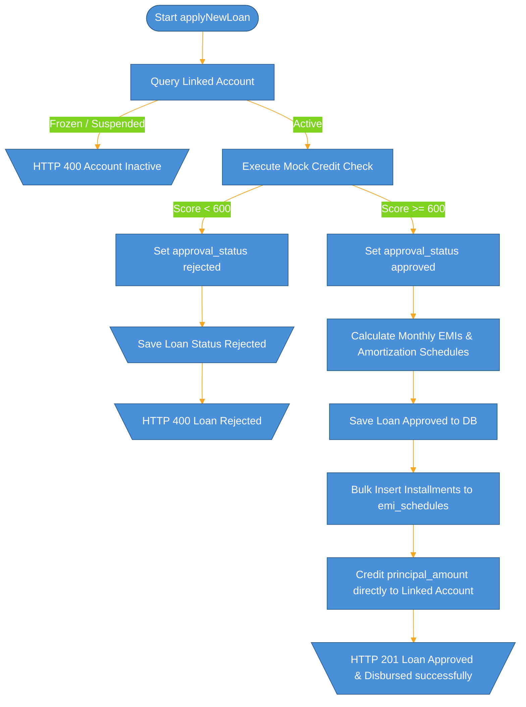

---

### 7.6 Fixed Deposit Module (`FD-service`)

#### 7.6.1 `createFD`
- **Input**:
  - `req.body.principal_amount`, `req.body.interest_rate`, `req.body.tenure_months`, `req.body.account_id`.
- **Steps**:
  1. Verifies checking account active balances. If insufficient, rejects.
  2. Debits principal amount from source available balances immediately.
  3. Computes FD maturity schedules and yield sums.
  4. Creates `fds` table database entries.
- **Output**:
  - Success: HTTP 201 created FD details.
- **Models Used**: `Account`, `FD`.

#### 7.6.2 `closeFD`
- **Input**:
  - `req.params.id`.
- **Steps**:
  1. Queries target FD row.
  2. Calculates payout values (applies premature closure penalty adjustments if closed before maturity_date).
  3. Credits calculated payout sum back into the customer's source account available balance.
  4. Updates FD status to `CLOSED`.
- **Output**:
  - Success: HTTP 200.
- **Models Used**: `Account`, `FD`.

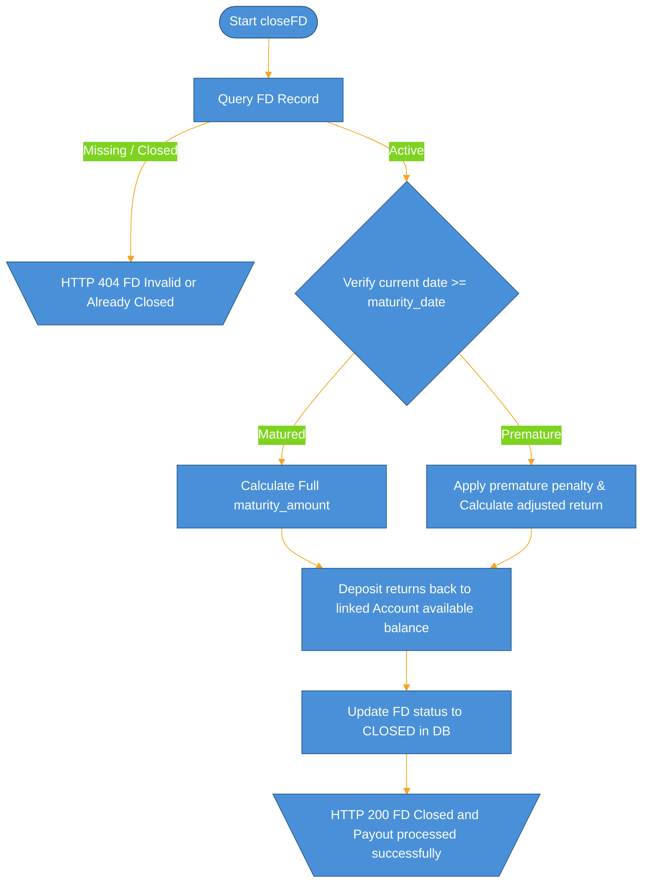

---

### 7.7 Credit Card Module (`credit-card-service`)

#### 7.7.1 `applyNewCard`
- **Input**:
  - `req.body.card_type`, `req.body.linked_account_id`.
- **Steps**:
  1. Evaluates user income profile.
  2. Generates 16-character credit card number.
  3. Allocates spend limit ranges based on income metrics.
  4. Saves card details row in `CreditCards` table.
- **Output**:
  - Success: HTTP 201.
- **Models Used**: `CreditCard`.

#### 7.7.2 `processCardPurchase`
- **Input**:
  - `req.body.card_number`, `req.body.amount`, `req.body.merchant_name`.
- **Steps**:
  1. Queries card record. Checks if status is `active`.
  2. Checks if amount is within `available_limit`. If exceeded, rejects.
  3. Subtracts amount from `available_limit`, adding it to `outstanding_balance`.
  4. Records purchase entry.
- **Output**:
  - Success: HTTP 200.
- **Models Used**: `CreditCard`.

#### 7.7.3 `generateCardStatement`
- **Input**:
  - `req.params.id`.
- **Steps**:
  1. Checks billing cycle date against active timelines.
  2. Compiles monthly purchase totals.
  3. Applies interest accrued on outstanding balances and adds penalties if minimum due was missed.
  4. Sets billing statement due date.
- **Output**:
  - Success: HTTP 200 with statement.
- **Models Used**: `CreditCard`.

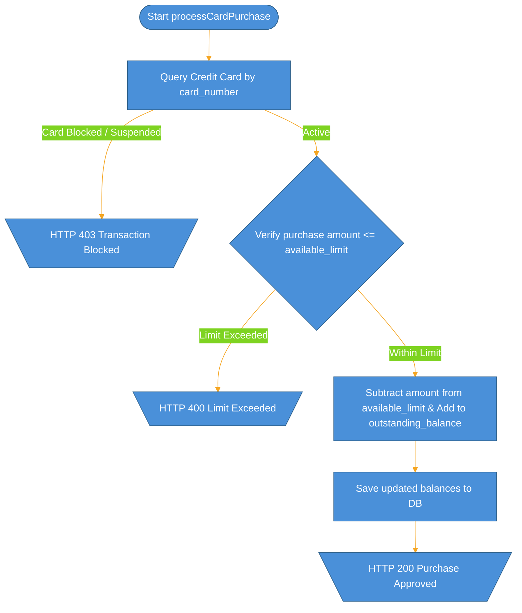

---

### 7.8 Wealth Management & Investment Module (`investment-service`)

#### 7.8.1 `buyInvestmentProduct`
- **Input**:
  - `req.body.product_id`, `req.body.amount`, `req.body.source_account_id`.
- **Steps**:
  1. Checks product availability status and NAV parameters.
  2. Verifies purchase amount exceeds the minimum investment threshold.
  3. Checks source account balances.
  4. Deducts capital sum from linked account.
  5. Computes asset shares/units based on current execute NAV value.
  6. Performs upsert on `investment_holdings` to add shares.
  7. Updates user `portfolios` variables.
  8. Inserts row inside `investment_transactions` table.
- **Output**:
  - Success: HTTP 200 order details.
- **Models Used**: `Account`, `InvestmentProduct`, `Portfolio`, `Holding`, `InvestmentTransaction`.

#### 7.8.2 `sellInvestmentProduct`
- **Input**:
  - `req.body.product_id`, `req.body.units`, `req.body.destination_account_id`.
- **Steps**:
  1. Queries active user holdings. If sold units exceed holding unit balance, rejects.
  2. Computes liquidation returns (units * current NAV value).
  3. Credits target cash returns directly to checking/savings balance.
  4. Updates or deletes holding record.
  5. Recalculates net portfolio metrics and logs transaction.
- **Output**:
  - Success: HTTP 200 sell confirmations.
- **Models Used**: `Account`, `InvestmentProduct`, `Portfolio`, `Holding`, `InvestmentTransaction`.

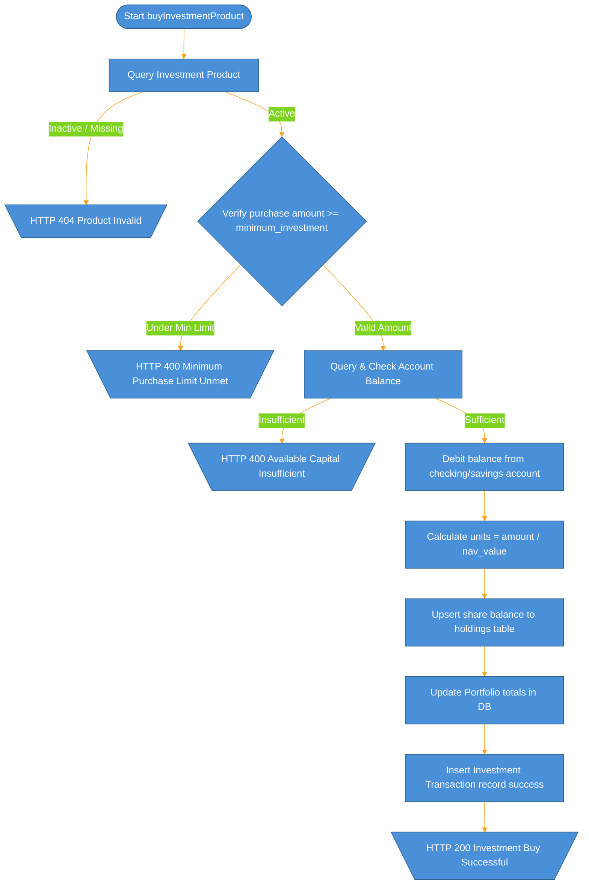

---

### 7.9 Payment Tracking Module (`payment-tracking-service`)

#### 7.9.1 `createPayment`
- **Input**:
  - `req.body` containing `payment_type`, `amount`, `payment_method`, `merchant_name`, `category`, `reference_id`, `related_entity_id`, `description`.
- **Steps**:
  1. Validates inputs.
  2. Inserts payment tracking record.
- **Output**:
  - Success: HTTP 201 payment tracking log.
- **Models Used**: `PaymentTracking`.

---

### 7.10 Administrative Module (`admin-service`)

#### 7.10.1 `verifyKYC`
- **Input**:
  - `req.params.user_id`.
- **Steps**:
  1. Queries target user.
  2. Overrides `kyc_status` to `verified` and `status` to `active`.
  3. Enables checking accounts linked to user profile.
- **Output**:
  - Success: HTTP 200.
- **Models Used**: `User`, `Account`.

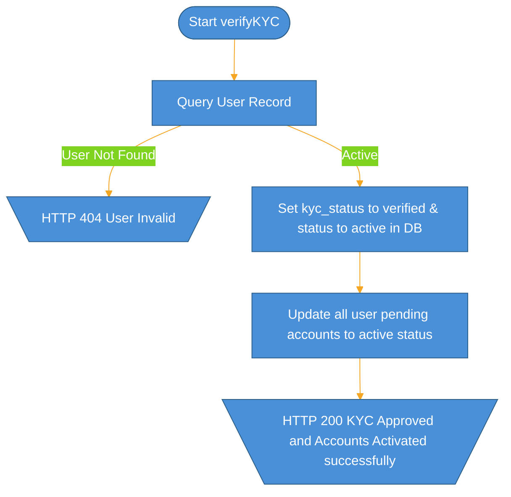

---

## 8. Frontend Architecture

### 8.1 Folder Structure

The React 19 SPA frontend codebase uses a modular layout structured as follows under the `src` directory:

```text
src/
├── api/             # API connection handlers
│   └── api.js       # Central axios interceptors & modular service fetches
├── components/      # View pages, modals, navigation and reusable components
│   ├── AdminPanel.js         # Backend admin management view
│   ├── Dashboard.js          # Main customer dashboard metrics & balances
│   ├── FDPage.js             # Fixed Deposit application & premature closures
│   ├── ProfilePage.js        # Demographic details & document KYC submissions
│   ├── AccountsPage.js       # Account balance openings & closures
│   ├── CreditCardsPage.js    # Credit limit logs, block/unblocks, payments
│   ├── LoansPage.js          # Credit scorings, EMI amortizations, payouts
│   ├── InvestmentsPage.js    # Nav history graphs, buy/sells of mutual funds
│   ├── TransactionsPage.js   # Ledger debit/credit deposits and transfers
│   ├── PaymentTrackingPage.js# Category breakdowns and utility invoices
│   ├── Navbar.js             # Top headers navigation toggles
│   ├── Sidebar.js            # Lateral app routing navigation bar
│   ├── Toast.js              # High-fidelity micro-notification toasts
│   └── ProtectedRoute.js     # Router protection validating cookie sessions
├── context/         # React Contexts
│   └── AuthContext.js        # Global login, role states and toast hooks
├── utils/           # Utilities
│   └── formatters.js         # Currency and datetime parsers
├── App.js           # Core layout configuration & Router mappings
├── index.js         # Application bootstrap mount
├── App.css          # Styled UI parameters & animations
└── index.css        # Layout structure tokens
```

---

### 8.2 Routing

The client-side routing is configured using `react-router-dom` in `App.js`. Access is controlled by custom `ProtectedRoute` tags:

| Path | Rendered Component | Protected or Public | Role Required |
|---|---|---|---|
| `/` | `HeroSection` | Public | None |
| `/dashboard` | `Dashboard` | Protected | User / Admin |
| `/profile` | `ProfilePage` | Protected | User / Admin |
| `/accounts` | `AccountsPage` | Protected | User / Admin |
| `/credit-cards` | `CreditCardsPage` | Protected | User / Admin |
| `/loans` | `LoansPage` | Protected | User / Admin |
| `/fd` | `FDPage` | Protected | User / Admin |
| `/investments` | `InvestmentsPage` | Protected | User / Admin |
| `/transactions` | `TransactionsPage` | Protected | User / Admin |
| `/payment-tracking` | `PaymentTrackingPage` | Protected | User / Admin |
| `/admin` | `AdminPanel` | Protected | Admin |
| `*` | Redirect to `/` | Public | None |

---

### 8.3 Page to API Mapping

The following table documents every API interaction triggered by the React components, corresponding to the service methods in `api.js`:

| Page / Component | API Call Made | Method | Backend Endpoint Hit | Description |
|---|---|---|---|---|
| `Navbar` / `Sidebar` | `authAPI.logout` | POST | `/auth/logout` | Revokes server-side session cookies. |
| `LoginModal` | `authAPI.login` | POST | `/auth/login` | Passes email/password to retrieve cookies. |
| `LoginModal` | `authAPI.forgotPassword` | POST | `/auth/forgot-password` | Requests OTP password recovery. |
| `LoginModal` | `authAPI.resetPassword` | POST | `/auth/reset-password` | Updates password credentials. |
| `RegisterModal` | `authAPI.register` | POST | `/auth/register` | Sends onboarding and core account details. |
| `RegisterModal` | `authAPI.verifyEmail` | POST | `/auth/verify-email` | Inputs verification OTP to activate account. |
| `RegisterModal` | `authAPI.resendVerificationOtp`| POST | `/auth/resend-verification-otp`| Regens expired registration verification OTPs.|
| `ProfilePage` | `userAPI.getProfile` | GET | `/user/me` | Fetches active customer profile record. |
| `ProfilePage` | `userAPI.updateProfile` | PUT | `/user/me` | Saves updated demographics settings. |
| `ProfilePage` | `userAPI.updateKYC` | PATCH | `/user/kyc` | Submits KYC onboarding files. |
| `ProfilePage` | `userAPI.resetTransactionPin` | POST | `/user/reset-transaction-pin`| Encrypts and saves fresh transaction PIN. |
| `AccountsPage` | `accountAPI.getMyAccounts` | GET | `/accounts/user/me` | Pulls savings and checking accounts list. |
| `AccountsPage` | `accountAPI.createAccount` | POST | `/accounts` | Requests opening of a checking balance. |
| `AccountsPage` | `accountAPI.closeAccount` | DELETE | `/accounts/:id` | Soft-closes a zero-balance account. |
| `Dashboard` / `Transactions`| `transactionAPI.transfer` | POST | `/transactions/transfer` | Processes PIN-authorized bank transfers. |
| `Dashboard` / `Transactions`| `transactionAPI.deposit` | POST | `/transactions/deposit` | Simulates cash loading into balances. |
| `Dashboard` / `Transactions`| `transactionAPI.withdraw` | POST | `/transactions/withdraw` | Deducts balances from a specific account. |
| `Dashboard` / `Transactions`| `transactionAPI.getHistory` | GET | `/transactions/history/:id` | Returns credit/debit logs for an account. |
| `LoansPage` | `loanAPI.getMyLoans` | GET | `/loans/user/me` | Pulls user active loan applications. |
| `LoansPage` | `loanAPI.getActiveLoansSummary`| GET | `/loans/active-summary` | Aggregates active liabilities and total EMIs. |
| `LoansPage` | `loanAPI.applyForLoan` | POST | `/loans/apply` | Files a new loan contract application. |
| `LoansPage` | `loanAPI.makePayment` | POST | `/loans/payment` | Processes scheduled monthly loan EMIs. |
| `LoansPage` | `loanAPI.getLoanSchedule` | GET | `/loans/schedule/:id` | Renders installment due details checklist. |
| `LoansPage` | `loanAPI.getForeclosurePreview`| GET | `/loans/foreclose-preview/:id` | Computes payoff figures. |
| `LoansPage` | `loanAPI.forecloseLoan` | POST | `/loans/foreclose/:id` | Instantly pays outstanding loan principal. |
| `FDPage` | `fdAPI.getMyFDs` | GET | `/fd/` | Renders list of active user Fixed Deposits. |
| `FDPage` | `fdAPI.createFD` | POST | `/fd/create` | Spawns Fixed Deposit checking debit. |
| `FDPage` | `fdAPI.closeFDPremature` | POST\* | `/fd/:id/close`\* | Prematurely closes target Fixed Deposit. |
| `InvestmentsPage` | `investmentAPI.getMarketOverview`| GET | `/investments/market` | Retrives market asset profiles and NAVs. |
| `InvestmentsPage` | `investmentAPI.getProducts` | GET | `/investments/products` | Lists buyable fund products. |
| `InvestmentsPage` | `investmentAPI.getProductNavHistory`| GET | `/investments/products/:id/nav-history`| Returns product pricing history graph points. |
| `InvestmentsPage` | `investmentAPI.getPortfolio` | GET | `/investments/portfolio/me` | Computes customer holding asset evaluations. |
| `InvestmentsPage` | `investmentAPI.buyInvestment` | POST | `/investments/buy` | Purchases units of a mutual fund asset. |
| `InvestmentsPage` | `investmentAPI.sellInvestment` | POST | `/investments/sell` | Liquidates asset units into checking cash. |
| `InvestmentsPage` | `investmentAPI.getStatement` | GET | `/investments/statement/me` | Generates trading transaction ledger lines. |
| `CreditCardsPage` | `creditCardAPI.getMyCards` | GET | `/credit-cards/user/me` | Pulls credit cards owned by customer. |
| `CreditCardsPage` | `creditCardAPI.applyForCard` | POST | `/credit-cards/apply` | Onboards user for credit limits. |
| `CreditCardsPage` | `creditCardAPI.processPurchase` | POST | `/credit-cards/purchase` | Triggers a card checkout transaction. |
| `CreditCardsPage` | `creditCardAPI.makePayment` | POST | `/credit-cards/payment` | Settles outstanding statement balance. |
| `CreditCardsPage` | `creditCardAPI.blockCard` | PATCH | `/credit-cards/block/:id` | Suspend active transactions. |
| `CreditCardsPage` | `creditCardAPI.unblockCard` | PATCH | `/credit-cards/unblock/:id` | Re-enables suspended transactions. |
| `CreditCardsPage` | `creditCardAPI.getStatement` | GET | `/credit-cards/statement/:id` | Resolves interest fees and compiles statement. |
| `CreditCardsPage` | `creditCardAPI.closeCard` | PATCH | `/credit-cards/close/:id` | Processes credit card soft-closures. |
| `CreditCardsPage` | `creditCardAPI.deleteCard` | DELETE | `/credit-cards/:id` | Purges card details from system profiles. |
| `PaymentTrackingPage` | `paymentTrackingAPI.getPayments`| GET | `/payments` | Loads invoice logs history. |
| `PaymentTrackingPage` | `paymentTrackingAPI.getAnalytics`| GET | `/payments/analytics` | Compiles category analytics datasets. |
| `PaymentTrackingPage` | `paymentTrackingAPI.createPayment`| POST | `/payments/create` | Adds utility invoice tracker record. |
| `AdminPanel` | `userAPI.getAllUsers` | GET | `/user/all` | Pulls customer listings for admin tools. |
| `AdminPanel` | `userAPI.updateUserStatus` | PATCH | `/user/status` | Overrides customer state (block/unblock). |

> [!WARNING]
> **API Interface Discrepancies**:
> 1. *Fixed Deposit Premature Closure*: The React frontend helper `fdAPI.closeFDPremature` makes a `POST` request to `/fd/:id/close`. However, the backend router in `fd.routes.js` listens to a `PATCH` request on `/fd/close/:id`. This represents an integration gap that requires synchronization in a subsequent phase.

---

### 8.4 Frontend Flow Diagram

Below is the complete client-side routing state machine. Public areas can render modals to perform credentials checks, routing verified users into the main protected customer portal area:

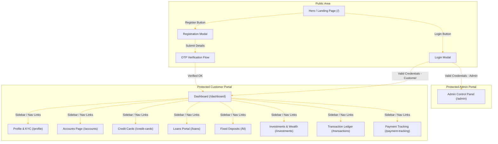

---

## 9. Security Architecture

The Banking Application implements a multi-layered security model derived strictly from the codebase middleware, verification logic, and controller components.

### 9.1 Authentication Flow

1. **Credentials Dispatch**: The customer submits email and password strings via the React `LoginModal`.
2. **Server-Side Verification**: The `auth-service` hashes credentials and checks them against the database `password_hash` using `bcrypt.compare`.
3. **Session Initialisation**: Upon validation, the server generates cryptographically signed JWT tokens (`access_token` with a 15-minute expiry, and `refresh_token` with a 7-day expiry).
4. **Session Registration**: The server registers the rotated `refresh_token` in the `sessions` table (salted and stored using a bcrypt hash).
5. **Secure Cookie Set**: The API Gateway intercepts the response and pushes both tokens back to the customer's browser strictly in `httpOnly` secure cookies with `sameSite: "Strict"`.
6. **Automatic silently refresh**: The frontend custom API interceptor in `api.js` captures any `401 Unauthorized` responses and automatically triggers silent refresh calls (`/auth/refresh`) to renew expired access cookies, preventing session interruptions.

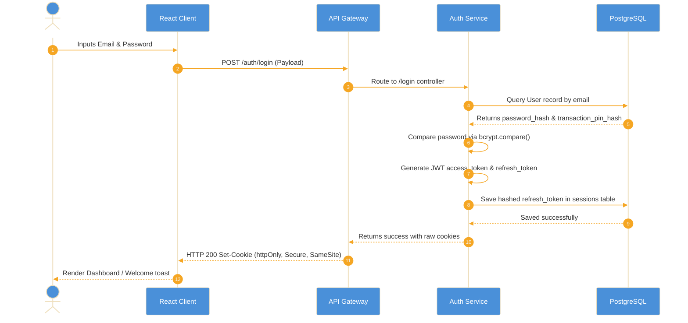

---

### 9.2 Authorization Layers

Access management is enforced via modular middlewares mounted in Express router chains:

1. **`authenticateToken` Middleware (`authMiddleware.js`)**:
   - **Applied to**: Mounted at the API Gateway router layer for all routes except `/auth/*` public endpoints.
   - **Check**: Reads `access_token` strictly from `req.cookies`. Decodes payload signature against `process.env.JWT_SECRET`.
   - **Blocking Action**: Rejects requests with `HTTP 401 Unauthorized` (message: "Authentication token required" or "Invalid or expired token") if the cookie is absent or structurally invalid.
   - **Context Injection**: Attaches decoded `req.user = { user_id, email, role }` parameters to the active request flow.

2. **`requireAdmin` Middleware (`authMiddleware.js`)**:
   - **Applied to**: Mounts at administrative controllers (`admin-service` routes and select user lifecycle endpoints).
   - **Check**: Examines the injected `req.user.role` parameter value.
   - **Blocking Action**: Rejects requests with `HTTP 403 Forbidden` (message: "Admin access required") if role is not equal to `admin`.

3. **`verifyTransactionPin` Middleware (`pinMiddleware.js`)**:
   - **Applied to**: High-risk financial operations (`/transactions/transfer`, `/transactions/withdraw`, and `/transactions/deposit`).
   - **Check**: extracts the transaction PIN from `req.body.transaction_pin` and executes a comparative `bcrypt.compare` call against the user's `transaction_pin_hash` loaded from PostgreSQL.
   - **Blocking Action**: Rejects requests with `HTTP 400 Bad Request` if PIN is missing, `HTTP 404 Not Found` if user record is missing, or `HTTP 401 Unauthorized` (message: "Invalid transaction PIN") on hash mismatch.

---

### 9.3 Data Security

1. **Cryptographic Salting**: All user account credentials (passwords, transaction authorization PINs) are salted and hashed using `bcrypt` (10 salt rounds) before database persistent writing.
2. **One-Time Passwords (OTP)**:
   - Verification and password recovery OTPs are generated as cryptographically sound random 6-character strings mapped inside `email_otps` table.
   - OTP records enforce strict timelines (`expires_at`), usage flags (`is_used`), and max invalid attempt limits (locked out after 3 failures).
3. **Cross-Site Defenses**:
   - JWT transmission is insulated from browser storage via `httpOnly` secure cookies.
   - Cross-Site Request Forgery is mitigated using `sameSite: "Strict"` cookies.
4. **Input Verification Sanitization**:
   - Modular input validators (`loginValidator`, `authValidator`, `userValidator`, `accountValidator`, `fd.validation.js`) screen all inbound payloads, preventing malformed objects from reaching ORM models.

---

## 10. Error Handling Patterns

The microservice codebase handles service exceptions and validation failures using a structured JSON pattern:

### 10.1 HTTP Response Status Code Registry

| Status Code | Usage Scenarios | Typical Response Example |
|---|---|---|
| **200 OK** | Successful read queries, profile updates, and standard financial operations. | `{ "success": true, "message": "Operation completed successfully" }` |
| **201 Created** | Onboarded users, created bank checking accounts, and activated loan schedules. | `{ "success": true, "user": { ... } }` |
| **400 Bad Request** | Missing transaction PIN parameters, validation failures, or min balance limit errors. | `{ "success": false, "message": "Transaction PIN is required" }` |
| **401 Unauthorized** | Invalid credentials, missing access cookies, or incorrect transaction PIN matches. | `{ "success": false, "message": "Invalid transaction PIN" }` |
| **403 Forbidden** | KYC document unverified, suspended accounts, or admin permission failures. | `{ "success": false, "message": "Admin access required" }` |
| **404 Not Found** | Query targets missing from database (e.g. invalid accounts, user profiles, or loan IDs). | `{ "success": false, "message": "User not found" }` |
| **409 Conflict** | demograhics input keys (Email, Phone, Aadhaar, PAN) already linked to active accounts. | `{ "success": false, "message": "User with provided Aadhaar already exists" }` |
| **500 Internal Error** | Unhandled database connection crashes or generic code syntax failures. | `{ "success": false, "message": "Internal server error during registration" }` |

### 10.2 Structured Error Handling Pattern

Controllers consistently wrap async operations in standard `try-catch` structures. Below is the generalized implementation pattern:

```javascript
try {
  // Validate inputs
  const validation = validateInput(req.body);
  if (!validation.valid) {
    return res.status(400).json({ success: false, errors: validation.errors });
  }

  // Model Operations
  const record = await Model.findByPk(req.params.id);
  if (!record) {
    return res.status(404).json({ success: false, message: "Resource not found" });
  }

  // Mutate and save
  await record.update(req.body);
  return res.status(200).json({ success: true, record });
} catch (error) {
  console.error("Contextual Error Prefix:", error);
  return res.status(500).json({ 
    success: false, 
    message: "Generic localized error description",
    error: process.env.NODE_ENV === "development" ? error.message : undefined 
  });
}
```

### 10.3 Unhandled Edge Cases & Critical Vulnerabilities

1. **Transactional Race Conditions**:
   - The transaction service (`transaction-service`) executes balance updates within Sequelize transactions. However, it does not apply row-level pessimistic locks (e.g., `lock: transaction.LOCK.UPDATE`) or optimistic locking mechanisms (`version: true`).
   - *Risk*: A user can trigger multiple rapid, concurrent fund transfers, leading to race conditions where the balance is read simultaneously in concurrent threads before it is debited, resulting in account balances drifting below the minimum balance limits or overdraft limits.
2. **Notification Pipeline Blocks**:
   - Notification triggers are executed synchronously within controllers using direct Axios requests or integrated service modules.
   - *Risk*: If the SMTP server or network connection fails during an operation, the entire controller throws an exception, rolling back database operations or returning a 500 status to the user. Core financial operations should be decoupled from notifications using message queues or background workers.

---

## 11. Known Limitations and Technical Debt

Conducting a thorough full-stack audit reveals several technical inconsistencies, missing validation layers, and gaps between backend capability and frontend implementation.

### 11.1 Integration Gaps & Partial Implementations

1. **Administrative Front-End Dashboard**:
   - *Backend*: The `admin-service` implements complete, functional admin routes (suspending users, reviewing system-wide audit logs, manually verifying KYC compliance, and freezing bank accounts).
   - *Frontend*: The React SPA is missing a user-facing administrative interface. The router maps `/admin` to `<AdminPanel />`, but this page is stubbed with list panels and lacks direct, production-grade tools.
2. **Fixed Deposit Integration Discrepancies**:
   - *Backend*: The premature closure route (`fd.routes.js`) expects a `PATCH` request at the endpoint `/fd/close/:id`.
   - *Frontend*: The client-side connection wrapper (`fdAPI` in `api.js`) triggers a `POST` request to `/fd/:id/close`. This endpoint mismatch will trigger a `404 Not Found` when a user attempts premature closure of a Fixed Deposit.
3. **Fixed Deposit Schedule Automation**:
   - *Backend*: The interest schedules and maturity payments are stubbed or require manual trigger crons.
   - *Frontend*: The client-side dashboard stubs maturity rates and projections instead of loading them dynamically from active database calculations.

### 11.2 Hardcoded Values & Mock Data

1. **Credit Scoring Scoring Engine**:
   - Loan applications (`loanController.js`) trigger a mock credit bureau rating calculation. It returns a hardcoded rating or executes a randomizer. Real deployment requires integration with a credit history check service.
2. **Investment NAV Market Engine**:
   - Mutual fund pricing and performance histories (`investmentController.js`) are randomized mock parameters generated dynamically. These calculations must be backed by a cron-driven market crawler.

### 11.3 Traceability Code Tags (TODOs)

The following development tags remain in the codebase:
*   `// TODO: Add support for interest schedules parsing.` — `FD-service` controllers.
*   `// TODO: Configure real SMTP credentials for production environments.` — `notification-service` connection scripts.
*   `// TODO: Implement optimistic locking models to prevent race conditions on balance changes.` — `transaction-service` model declarations.

---
Document generated from codebase analysis.
Project: Banking Application — Internship Training


