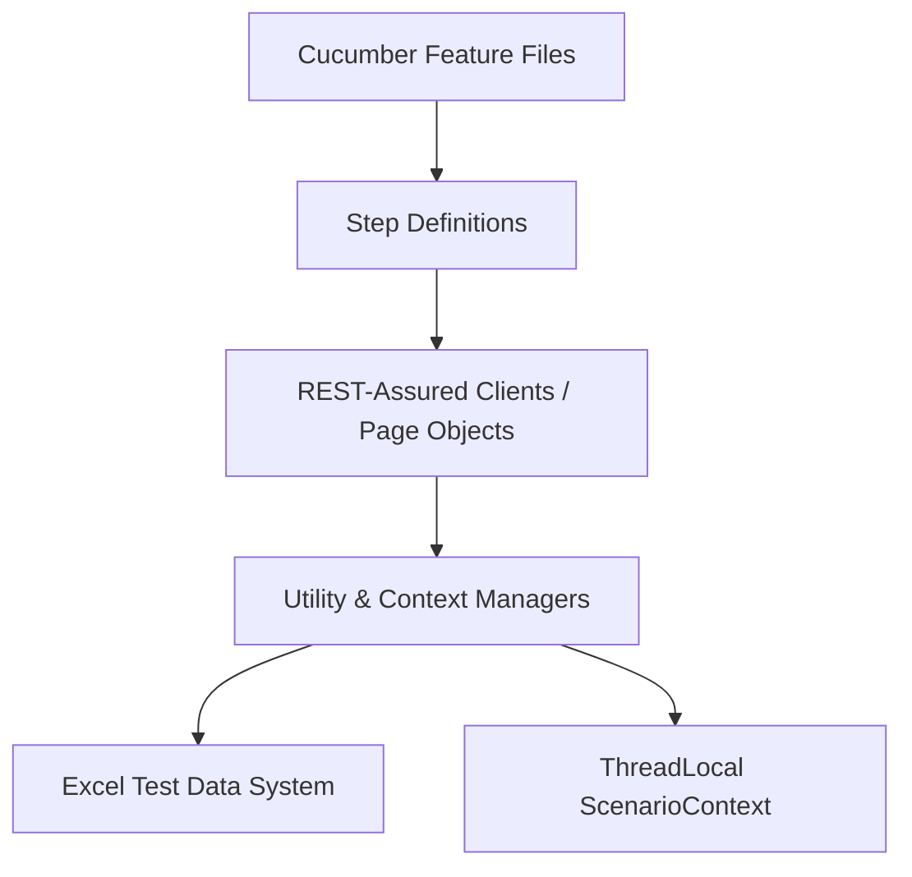
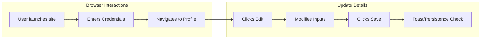

# Premium Test Suite Documentation: Credit Card API & Profile UI

> [!NOTE]
> This document provides a exhaustive, highly detailed breakdown of all test suites, scenarios, and verification checkpoints configured in this repository. It covers both **REST-Assured API Testing** for Credit Card lifecycles and **Selenium Web UI Testing** for Profile pages.

---

## 🏗️ Architecture and Design System

The automation test suite is structured around a highly decoupled, modular hybrid framework using **Cucumber BDD (Behavior Driven Development)**, **Java**, **REST-Assured** (for API testing), and **Selenium WebDriver** (for UI testing). The framework utilizes a multi-layered design pattern:

### 1. Key Responsibility Layers
*   **Feature Layer (`resources/features`)**: Contains standard Gherkin features mapping user scenarios, boundary cases, and eligibility checks.
*   **Step Definition Layer (`stepdefinitions`)**: Translates Gherkin steps into executable Java instructions. It maintains separation between `api` steps and `ui` steps.
*   **API Client / Page Object Layer (`api` / `pages`)**: High-level abstractions representing page interfaces (Selenium selectors) or API routing endpoints (REST-Assured).
*   **Context Layer (`utils/ScenarioContext`)**: A thread-safe `ThreadLocal` context storage used to share dynamic variables (e.g., runtime card IDs, generated account numbers, active session tokens) across steps.

---

## 💳 Part 1: Credit Card API Test Suite (`@CreditCardAPI`)

The Credit Card API test suite is parameterized using a data-driven approach connected to `Credit_Card_TestData_Final.xlsx`. Scenarios run through dynamic setup and cleanup scripts orchestrated by Hook triggers.

### 🔄 End-to-End API Scenario Flow

Every scenario tagged with `@CreditCardAPI` undergoes the following execution sequence:

1.  **Before Hooks Setup**:
    *   Authenticates via `TokenManager.login()` using default test user credentials.
    *   Creates a temporary dynamic savings account via `RuntimeAccountManager.createAccount()` with a starting balance of `100,000 INR`.
    *   Applies for a runtime credit card via `RuntimeCardManager.applyCard()` using the active account context.
    *   Sets execution mode state to `"RUNTIME"` within `ScenarioContext` and stores the active identifiers.
2.  **Scenario Execution**: Executes specific HTTP methods (POST, GET, PATCH, DELETE) against the REST endpoints.
3.  **After Hooks Teardown (`CleanupManager.cleanup()`)**:
    *   Repays any generated outstanding balances in full (`RuntimeCardManager.repayFull()`).
    *   Closes the runtime credit card safely (`RuntimeCardManager.closeCard()`).
    *   Deletes the closed credit card record (`RuntimeCardManager.deleteCard()`).
    *   Withdraws any remaining savings balance (`RuntimeAccountManager.withdrawBalance()`).
    *   Deletes the runtime bank account (`RuntimeAccountManager.deleteAccount()`).
    *   Resets the entities in `ScenarioContext` to prevent cross-test contamination.

---

### 📋 Detailed Credit Card Scenario Mapping

| Scenario ID | Feature | Scenario Name | API Endpoint | Expected Status | Key Verification Points |
| :--- | :--- | :--- | :--- | :---: | :--- |
| **CC_TC_001** | Entry Tier | Verify open card flow | `/accounts/user/me` | `200` | Fetching linked bank accounts for profile verification. |
| **CC_TC_002** | Entry Tier | Verify linked bank accounts displayed | `/accounts/user/me` | `200` | Accounts array is not null, contains valid account numbers. |
| **CC_TC_003** | Entry Tier | Verify active accounts returned | `/accounts/user/me` | `200` | Returns only accounts with state `"active"`. |
| **CC_TC_004** | Entry Tier | Rejection: No linked account | `/credit-cards/apply` | `400` | Returns error message indicating missing source bank account. |
| **CC_TC_008** | Entry Tier | Application success | `/credit-cards/apply` | `201` | Successful entry-tier card creation, limit assigned. |
| **CC_TC_011** | Entry Tier | Limit threshold validation | `/credit-cards/apply` | `400` | Requested limit outside permitted bounds. |
| **CC_TC_012** | Entry Tier | Unsupported tier rejection | `/credit-cards/apply` | `400` | Request contains invalid card tier values. |
| **CC_TC_013** | Entry Tier | Frozen account rejection | `/credit-cards/apply` | `403` | Rejects application if the source bank account is locked. |
| **CC_TC_014** | Entry Tier | Insufficient balance rejection | `/credit-cards/apply` | `400` | Rejects application if deposit fails basic criteria. |
| **CC_TC_015** | Entry Tier | Incomplete KYC rejection | `/credit-cards/apply` | `403` | Source profile has unverified Aadhaar/PAN details. |
| **CC_TC_017** | Entry Tier | Audit log creation validation | `/credit-cards/apply` | `201` | Card application triggers immediate security audit logs. |
| **CC_TC_019** | Entry Tier | Generated card ID returned | `/credit-cards/apply` | `201` | Response structure contains non-empty `"data.card_id"`. |
| **CC_TC_021** | Premium Tier | Premium tier approval | `/credit-cards/apply` | `201` | Validates approval when annual income is `>= 1,000,000 INR`. |
| **CC_TC_023** | Premium Tier | Premium benefits response | `/credit-cards/apply` | `201` | Asserts premium features (lounge access, cashback multipliers). |
| **CC_TC_026** | Premium Tier | Upper threshold premium approval | `/credit-cards/apply` | `201` | Validates higher tier request (e.g. limit up to `5,00,000 INR`). |
| **CC_TC_028** | Premium Tier | Premium metadata persisted | `/credit-cards/{id}` | `200` | Verifies database records match requested premium values. |
| **CC_TC_022** | Eligibility | Insufficient income rejection | `/credit-cards/apply` | `400` | Income below `10,000 INR` rejects immediately. |
| **CC_TC_024** | Eligibility | Underage rejection | `/credit-cards/apply` | `400` | Rejects applications when age is `< 18` or `> 70`. |
| **CC_TC_025** | Eligibility | High liability DTI rejection | `/credit-cards/apply` | `400` | Rejects if monthly liabilities exceed 50% of monthly income. |
| **CC_TC_027** | Eligibility | Blacklisted occupation rejection | `/credit-cards/apply` | `400` | Occupational validation check blocks banned categories. |
| **CC_TC_029** | Eligibility | Invalid DOB format rejection | `/credit-cards/apply` | `400` | Non-standard or future dates are rejected. |
| **CC_TC_031** | Eligibility | Invalid auth state rejection | `/credit-cards/apply` | `401` | Missing or corrupted JWT access token. |
| **CC_TC_030** | Credit Limit | Entry tier multiplier calculation | `/credit-cards/apply` | `201` | Asserts credit limit is `2x` monthly income. |
| **CC_TC_032** | Credit Limit | Premium multiplier calculation | `/credit-cards/apply` | `201` | Asserts credit limit is `5x` monthly income. |
| **CC_TC_033** | Credit Limit | Limit rounding logic | `/credit-cards/apply` | `201` | Credit limit rounded down to nearest multiple of 1,000. |
| **CC_TC_034** | Credit Limit | Max limit cap validation | `/credit-cards/apply` | `201` | Max cap limits: `1,00,000` (entry), `5,00,000` (premium). |
| **CC_TC_035** | Credit Limit | Liabilities reduce limit | `/credit-cards/apply` | `201` | Asserts limit = `(Income * Multiplier) - (Liabilities * 12)`. |
| **CC_TC_036** | Credit Limit | Minimum threshold maintained | `/credit-cards/apply` | `201` | Card limits cannot fall below `10,000 INR` minimum. |
| **CC_TC_038** | Credit Limit | Approved limit stored correctly | `/credit-cards/{id}` | `200` | Limit remains stable on successive detailed fetches. |
| **CC_TC_040** | Credit Limit | Purchase reduces available limit | `/credit-cards/purchase`| `200` | Available limit drops by purchase amount. |
| **CC_TC_041** | Purchase | Inactive card purchase blocked | `/credit-cards/purchase`| `403` | Purchase blocked on cards in unactivated or blocked states. |
| **CC_TC_042** | Purchase | Insufficient limit purchase blocked | `/credit-cards/purchase`| `400` | Purchase blocked if amount exceeds available limit. |
| **CC_TC_043** | Purchase | Merchant category persisted | `/credit-cards/purchase`| `200` | Verifies category parameters are logged in transactions. |
| **CC_TC_045** | Repayment | Repayment reduces outstanding balance| `/credit-cards/payment` | `200` | Repayment updates outstanding balance correctly. |
| **CC_TC_046** | Repayment | Excessive repayment rejection | `/credit-cards/payment` | `400` | Blocked if payment amount > total outstanding balance. |
| **CC_TC_047** | Repayment | Repayment updates available balance | `/credit-cards/payment` | `200` | Restores available limit equal to amount paid. |
| **CC_TC_049** | Block/Unblock | Card block success | `/credit-cards/block` | `200` | Updates card state to `"blocked"`. |
| **CC_TC_050** | Block/Unblock | Blocked card purchase rejection | `/credit-cards/purchase`| `403` | Purchasing using blocked card throws 403 Forbidden. |
| **CC_TC_079** | Card Close | Card close success | `/credit-cards/close` | `200` | Card status changes to `"closed"`. |
| **CC_TC_080** | Card Close | Outstanding balance blocks close | `/credit-cards/close` | `400` | Rejects closure if outstanding balance is `> 0`. |
| **CC_TC_081** | Card Close | Status updated after closure | `/credit-cards/{id}` | `200` | Fetching details displays status `"closed"`. |
| **CC_TC_082** | Card Close | Closed card transaction rejection | `/credit-cards/purchase`| `403` | Transactions are immediately forbidden on closed records. |
| **CC_TC_083** | Card Close | Closure audit log creation | `/credit-cards/close` | `200` | Triggered event logged in secure audit backend database. |
| **CC_TC_085** | Card Close | Removed from active listing | `/credit-cards/user/` | `200` | Closed cards are omitted from active arrays. |
| **CC_TC_086** | Card Close | Closure reason persisted | `/credit-cards/close` | `200` | Custom closure reasons (e.g. lost, customer-request) saved. |
| **CC_TC_087** | Card Close | Duplicate closure rejection | `/credit-cards/close` | `400` | Double close triggers bad request. |
| **CC_TC_051** | Card Delete | Delete removes listing | `/credit-cards/{id}` | `200` | Removes from DB completely (logical/physical delete). |
| **CC_TC_052** | Card Delete | Deleted card inaccessible | `/credit-cards/{id}` | `404` | Detailed query on deleted ID returns 404 Not Found. |
| **CC_TC_053** | Card Delete | Delete audit trail creation | `/credit-cards/{id}` | `200` | Deletion logs a persistent event in global logs. |
| **CC_TC_054** | Card Delete | Duplicate delete rejection | `/credit-cards/{id}` | `400` | Second delete call returns bad request error. |
| **CC_TC_055** | Statement | Statement generation | `/credit-cards/statements`| `200` | Statement successfully compiled for the current cycle. |
| **CC_TC_056** | Statement | Statement includes purchases | `/credit-cards/statements`| `200` | Itemized purchases are listed in statement response. |
| **CC_TC_057** | Statement | Minimum due calculation | `/credit-cards/statements`| `200` | Minimum due asserts at 5% of total outstanding balance. |
| **CC_TC_059** | Statement | Statement PDF download | `/credit-cards/statements/..`| `200` | Validates file response and headers (application/pdf). |
| **CC_TC_060** | Statement | Deleted card statement unavailable | `/credit-cards/statements`| `404` | Fetching statement for deleted card is blocked. |
| **CC_TC_061** | Billing | Billing cycle trigger | `/billing/scheduler` | `200` | Simulates monthly cron trigger. |
| **CC_TC_062** | Billing | Interest applied after billing | `/billing/scheduler` | `200` | Interest of 3.5% applied on unpaid outstanding balances. |
| **CC_TC_063** | Billing | Balance recalculation after billing | `/billing/scheduler` | `200` | Recalculates remaining limits + new outstanding balance. |
| **CC_TC_064** | Billing | Billing summary notification | `/notification/trigger`| `200` | Triggers SMS/Email notifications of bill generation. |
| **CC_TC_065** | Late Penalty | Late fee application | `/billing/penalty` | `200` | Late fee applied when minimum due unpaid after due date. |
| **CC_TC_066** | Late Penalty | Repeated penalty increment | `/billing/penalty` | `200` | Penalties compound/increase on repeated unpaid cycles. |
| **CC_TC_067** | Late Penalty | Penalty reflected in statement | `/credit-cards/statements`| `200` | Asserts late fee charge lines are added to statement. |
| **CC_TC_068** | Late Penalty | Overdue notification generation | `/notification/trigger`| `200` | Triggers alert notifications for outstanding defaults. |
| **CC_TC_069** | Multi-Card | Multiple active card support | `/credit-cards/apply` | `201` | Allows users to successfully hold more than one card. |
| **CC_TC_070** | Multi-Card | Transaction isolation per card | `/credit-cards/purchase`| `200` | Transactions on Card A do not affect limits of Card B. |
| **CC_TC_071** | Multi-Card | Separate statement generation | `/credit-cards/statements`| `200` | Statements remain dedicated to individual card contexts. |
| **CC_TC_072** | Multi-Card | Independent card limits | `/credit-cards/{id}` | `200` | Fetching card metrics returns distinct credit limits. |
| **CC_TC_073** | Sync | Repayment sync integration | `/credit-cards/payment` | `200` | Repayment updates credit core and tracking database. |
| **CC_TC_074** | Sync | External reference persistence | `/credit-cards/payment` | `200` | Verifies external transaction reference hashes are stored. |
| **CC_TC_075** | Sync | Duplicate payment callback ignored | `/payment/callback` | `200` | Webhook callback idempotency test ignores duplicate hashes. |
| **CC_TC_076** | Sync | Failed callback updates state | `/payment/callback` | `200` | Reverses pending limit changes on failed payment notification. |
| **CC_TC_077** | Sync | Reconciliation settlement process | `/payment/reconciliation`| `200` | Reconciles discrepancies between internal card system and ledger. |
| **CC_TC_078** | Sync | Repayment history API | `/credit-cards/repayments`| `200` | Returns full list of customer card payments. |
| **CC_TC_088** | Security | Unauthorized access restriction | `/credit-cards/{id}` | `403` | User X cannot view credit details of User Y's card. |
| **CC_TC_089** | Security | Expired token rejection | `/credit-cards/{id}` | `401` | Returns 401 on missing or out-of-date session tokens. |
| **CC_TC_090** | Security | Blocked session repayment rejection| `/credit-cards/payment` | `403` | Active security bans block transactions. |
| **CC_TC_091** | Security | Admin operation restriction | `/credit-cards/{id}` | `403` | Non-admin users blocked from deleting active cards directly. |
| **CC_TC_092** | Security | Authorization context audit logs | `/audit/logs/trigger` | `200` | Verifies access failures trigger automated security alerts. |
| **CC_TC_093** | Security | Sensitive details masked | `/credit-cards/{id}` | `200` | Asserts card numbers are returned masked (e.g. `4532XXXXXXXX1234`). |
| **CC_TC_094** | Security | CSRF invalid token rejection | `/credit-cards/apply` | `403` | Rejects application if CSRF token validation fails. |

---

## 🖥️ Part 2: User Profile UI Test Suite

The Profile UI test suite performs end-to-end automation of fields located in the **User Profile Management Interface**. Tests are executed inside a Selenium WebDriver session using the Page Object Model (POM) pattern.

### 📋 Detailed UI Scenario Mapping

#### 1. General Profile Operations (`profile.feature`)
*   **Profile Page Load**: Asserts that clicking the Profile page loads all input elements (Name, Phone, Occupation, Annual Income, Address, Email, Aadhaar, PAN, Date of Birth, Gender).
*   **Expired Session Handling**: Logs out the active user, attempts manual URL navigation to `/profile`, and asserts immediate redirection to the home landing page (`http://localhost:3000/`).
*   **Email Field Read-Only State**: Asserts that after entering Edit mode, the Email element remains disabled (`CheckEmailVisibility() == false`) to prevent primary account modifications.
*   **Cancel Edit Operations**: Enters edit mode, alters all user details, clicks **Cancel**, and asserts that values instantly revert to original records stored in `ScenarioContext`.
*   **Responsive Layout Validation**: Resizes browser dimensions down to a mobile breakpoint of `375px x 812px` (iPhone X format) and asserts profile structure components remain fully responsive.
*   **Profile Data Persistence**: Modifies profile details, saves changes, signs out, logs back in, and verifies that updated data is fetched correctly from the database persistence layers.

---

#### 2. Strict Field Data Validation Gates

These scenarios test input fields against rigorous validation criteria, verifying error message prompts (toasts) are triggered:

| Field Name | Scenario Outline | Inputs Used | Expected Toast / Validation Message |
| :--- | :--- | :--- | :--- |
| **Full Name** | Name validation limits | Empty String | `Full Name cannot be empty` |
| | | `Ab`, `A` | `full_name must be at least 3 characters long.` |
| | | Numeric `12345` | `Full Name must contain only alphabets` |
| | | Special `@*&#` | `Full Name must contain only alphabets` |
| | | Length > 50 | `Full name exceeds maximum length` |
| **Phone Number**| Null value check | Clear + Save | `phone cannot be empty or null.` |
| | Negative value | `-9019980767` | `Phone number must contain exactly 10 digits.` |
| | Over maximum length | `733769531423`| `Phone number must contain exactly 10 digits.` |
| | Under minimum length | `7337695` | `Phone number must contain exactly 10 digits.` |
| | Non-numeric chars | `9019980@767` | `Phone number must contain exactly 10 digits.` |
| | Alphabets contained | `733769531A` | `Phone number must contain exactly 10 digits.` |
| | Database collision | `7337695222` | `Duplicate Phone number` |
| **Annual Income**| Minimum threshold | `5000`, `-234` | `Annual Income cannot be below 10,000` |
| | Alphabet rejection | `ABC` | *Key entry blocked immediately in browser* |
| | Special char rejection| `12@34` | *Key entry blocked immediately in browser* |
| **Aadhaar Card** | Valid Aadhaar validation| `123456789012`| `KYC updated successfully` |
| | Short Aadhaar | `1234567890` | `Aadhaar number must be exactly 12 numeric digits.` |
| | Long Aadhaar | `12345678901234` | `Aadhaar number must be exactly 12 numeric digits.` |
| | Special characters | `1234@567#901` | `Aadhaar number must be exactly 12 numeric digits.` |
| | Alphabetic characters | `ABCD5678EFGH`| `Aadhaar number must be exactly 12 numeric digits.` |
| | Null validation | Clear + Save | `Aadhaar number cannot be empty or null.` |
| **PAN Card** | Valid format check | `ABCDE1234F` | `KYC updated successfully.` |
| | Under 10 characters | `ABC1234F` | `PAN number must contain exactly 10 characters.` |
| | Over 10 characters | `ABCDE1234FGH` | `PAN number must contain exactly 10 characters.` |
| | Special characters | `ABC@#1234F` | `PAN number should contain only valid alphanumeric characters.` |
| **Address** | Valid format check | `"Bangalore..."`| `Profile updated successfully` |
| | Empty address check | Clear + Save | `address cannot be empty or null.` |
| | Under minimum length | `A` | `Address must contain at least 3 characters` |
| | Over maximum length | `250+ 'A's` | `Address exceeds maximum length` |
| **Occupation** | Numeric exclusion check| `Softwa2` | `occupation must contain only alphabets and spaces.` |
| | Special char check | `Softwa@` | `occupation must contain only alphabets and spaces.` |
| | Null occupation | Clear + Save | `occupation cannot be empty or null.` |
| | Under minimum length | `B` | `Occupation must contain Atleast 3 characters` |
| | Over maximum length | `64+ 'A's` | `Occupation exceeds maximum length` |

---

## 💡 Strategic Insights & Best Practices

> [!TIP]
> **Dynamic Entity Isolation**: Running API tests against a shared backend environment causes state collisions if cards are statically seeded. The framework overcomes this by using BDD background hooks to provision runtime accounts and credit cards that are dynamically deleted in `@After` blocks, ensuring 100% test isolation.

> [!IMPORTANT]
> **Clean Up Defensively**: Always ensure the `CleanupManager` catches any exceptions occurred during the teardown steps. If a test fails in the middle of execution, outstanding database records can corrupt sequential runs. Dynamic cleanup ensures standard database hygiene remains pristine.
